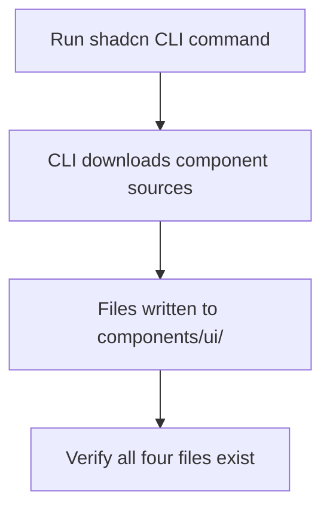

# Task 001 - Install shadcn UI components

## Reference

Plan document:

docs/plans/plan-age-1-app-shell.md

Relevant section:

Operation 1: Install shadcn components

---

## Description

Install the four shadcn component dependencies required by the app shell: `card`, `avatar`, `tooltip`, and `separator`. These components are prerequisites for the sidebar, top bar, and dashboard pages created in later tasks.

This task performs a single CLI command that scaffolds the component files into `components/ui/` using the project's existing `base-nova` style preset.

---

## Acceptance Criteria

- `components/ui/card.tsx` exists and exports `Card`, `CardHeader`, `CardTitle`, `CardDescription`, `CardContent`, `CardFooter`
- `components/ui/avatar.tsx` exists and exports `Avatar`, `AvatarImage`, `AvatarFallback`
- `components/ui/tooltip.tsx` exists and exports `Tooltip`, `TooltipTrigger`, `TooltipContent`, `TooltipProvider`
- `components/ui/separator.tsx` exists and exports `Separator`
- All component files use `@/components/ui` alias (no hardcoded paths)
- All component files use base primitives (not radix) per project configuration
- `npx shadcn@latest info` lists all four components as installed

---

## Out Of Scope

- No custom modification of the installed component files
- No usage of these components — they are scaffolding only
- `Sheet` component is not installed here (needed by mobile sidebar, see Task 005)

---

## Domain

### shadcn UI Components

The project uses shadcn/ui as its component library with the `base-nova` preset. Components are sourced as copyable source code rather than a bundled npm package. This task provisions the foundation UI building blocks — cards for stat displays, avatar for user section, tooltip for future hover interactions, and separator for visual dividers in the sidebar.

**Implementation scope:**

Run the shadcn CLI to add four components. No custom code is written.

---

## Graph

