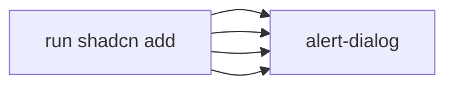

# Task 001 - Install shadcn form components

## Reference

Plan document:

docs/plans/plan-002-authentication.md

Relevant section:

### Dependencies

```
- input (for forms)
- label (for forms)
- dropdown-menu (for user menu)
- alert-dialog (for logout confirmation)
- separator (already installed)
```

---

## Description

Install four shadcn/ui components needed by auth forms and user menu. No new npm packages. This is plumbing — pure setup.

---

## Acceptance Criteria

- `input` component exists at `components/ui/input.tsx`
- `label` component exists at `components/ui/label.tsx`
- `dropdown-menu` component exists at `components/ui/dropdown-menu.tsx`
- `alert-dialog` component exists at `components/ui/alert-dialog.tsx`
- All four import without errors

---

## Out Of Scope

- Any customization of these components
- Creating new form patterns (handled later)
- CSS changes

---

## Domain

### shadcn/ui Components

Input, Label, DropdownMenu, and AlertDialog are shadcn/ui primitives. They follow the project's base-nova style using `data-slot` patterns, `@base-ui/react` primitives, and `cn()` for class merging.

This task installs them so other tasks can import and compose them.

---

## Graph

Not applicable — mechanical install.

