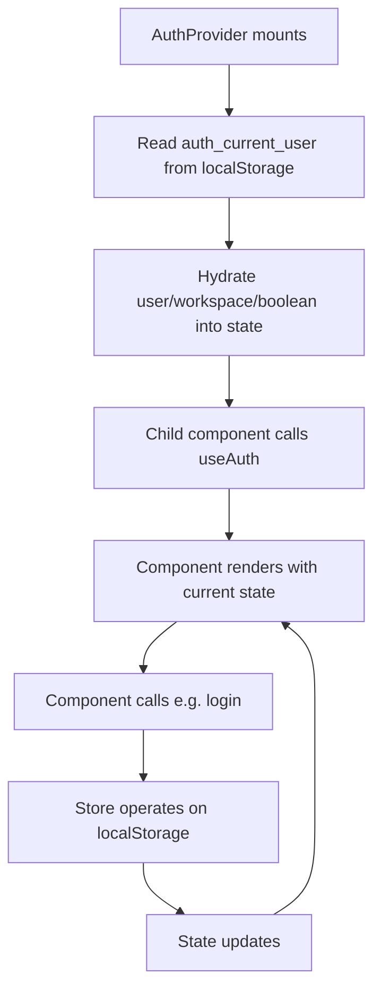

# Task 003 - Auth Context + Provider

## Reference

Plan document:

docs/plans/plan-002-authentication.md

Relevant sections:

- Approach: Context + Reducer for auth state
- Structure: `lib/auth-context.tsx` → React Context + Provider

---

## Description

Create `lib/auth-context.tsx` — a React Context that wraps auth store functions in stateful React. Exposes `authState` (user, workspace, isAuthenticated), actions (`login`, `signup`, `logout`, `createWorkspace`), and a `useAuth()` hook.

Uses `useState` + `useEffect` to init from localStorage on mount. Dispatches state updates after every auth store operation.

---

## Acceptance Criteria

- Export `AuthProvider` component that wraps children
- Export `useAuth()` hook — throws if used outside provider
- `useAuth().user` returns `User | null`
- `useAuth().workspace` returns `Workspace | null`
- `useAuth().isAuthenticated` returns `boolean`
- `useAuth().login(email, password)` calls store, updates state, returns result
- `useAuth().signup(email, password, confirm)` calls store, updates state, returns result
- `useAuth().logout()` calls store, clears state, redirects to `/`
- `useAuth().createWorkspace(name, plan)` calls store, updates state
- On mount, reads `auth_current_user` from localStorage and hydrates state
- `AuthProvider` accepts `children: React.ReactNode`
- Wrapped in `'use client'` directive

---

## Out Of Scope

- Page-level routing (handled by proxy in Task 010)
- Token cookie sync (store handles that, provider just reads state)
- Persisting state across tabs

---

## Domain

### AuthContext

The single source of truth in React land. It composes the pure auth store (Task 002) inside React's state model. Any component that calls `useAuth()` gets re-rendered when auth state changes — user, workspace, or isAuthenticated flag.

Hydration happens once on mount: reads `auth_current_user` from localStorage, parses it, populates state. This lets components render correctly even after hard refresh.

---

## Graph

Hydration and state update flow:

