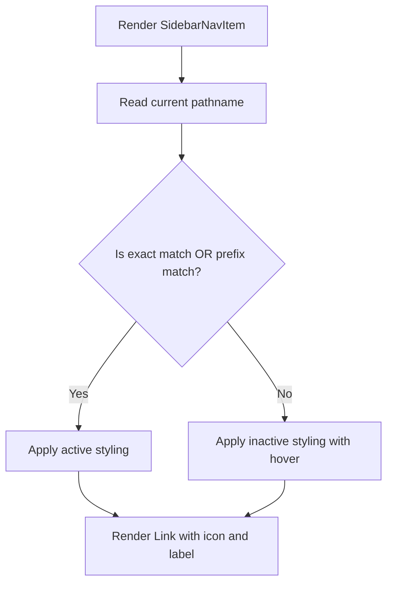

# Task 003 - Create sidebar nav item component

## Reference

Plan document:

docs/plans/plan-age-1-app-shell.md

Relevant section:

Operation 3: Create sidebar nav item component

---

## Description

Create the `SidebarNavItem` component in `components/layout/sidebar-nav-item.tsx`. This is the individual navigation link rendered inside the sidebar. It accepts an `href`, `label`, and `LucideIcon`, determines its active state based on the current pathname, and applies appropriate styling (accent background when active, hover state when not).

Active state is determined by exact pathname match for top-level routes or prefix match for nested routes (e.g., `/agents` is active when on `/agents/new`).

---

## Acceptance Criteria

- File `components/layout/sidebar-nav-item.tsx` exists
- Component accepts `href: string`, `label: string`, `icon: LucideIcon` props
- Uses `"use client"` directive
- Uses `usePathname()` from `next/navigation` for active state
- Uses `cn()` from `@/lib/utils` for conditional class merging
- Active state: highlighted with `bg-sidebar-accent text-sidebar-accent-foreground`
- Inactive state: has hover class `hover:bg-sidebar-accent/50`
- Active detection: exact match (`pathname === href`) OR prefix match (`pathname.startsWith(href + "/")`)
- Icon renders with `size-4` (no sizing on icons inside shadcn components per skill rules — but this is not a shadcn component, just a Link with icon)
- Link uses `next/link` for client-side navigation

---

## Out Of Scope

- Full sidebar component (created in Task 004)
- User profile section (part of sidebar component)
- Mobile navigation (Task 005)

---

## Domain

### Navigation Item

The sidebar presents seven navigation items (Home, Agents, Skills, Prompts, MCP Connections, Marketplace, Settings). Each item is a `<Link>` that performs client-side navigation. The active item is visually highlighted so the user always knows their current location. Prefix matching ensures nested routes (like `/agents/new`) highlight the parent item (`/agents`).

**Implementation scope:**

Single component with router integration. No additional dependencies beyond what already exists.

---

## Graph

