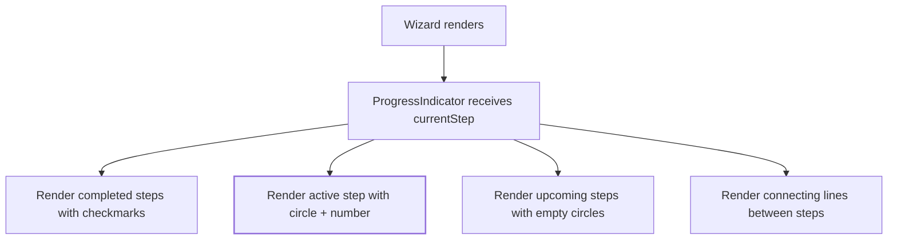

# Task 004 — Progress Indicator Component

## Reference

Plan document:

docs/plans/plan-AGE-3-agent-builder-wizard.md

Relevant section:

Operation 4: ProgressIndicator Component

---

## Description

Implement the step progress indicator used at the top of the agent builder wizard. It shows 5 steps (Goal → Tools → Skills → Context → Generate) with visual feedback for active, completed, and upcoming states.

This is the visual foundation — all step navigation depends on it.

---

## Acceptance Criteria

- `components/agent/wizard/ProgressIndicator.tsx` exists
- Has `"use client"` directive
- Accepts props: `steps: string[]`, `currentStep: number`, `onStepClick?: (step: number) => void`
- Renders horizontal step indicators with circles and connecting lines
- Completed steps show a filled circle with checkmark icon
- Active step shows a filled circle with step number
- Upcoming steps show an empty circle with step number
- Each step has a label displayed below the circle
- Steps are connected with horizontal separator lines
- Uses `cn()` for conditional class merging
- Uses shadcn `Separator` for connecting lines between steps
- Mobile responsive: hides labels on small screens, shows only circles
- Step click handlers only work on `completed` steps (back navigation) — active and upcoming steps are not clickable
- Uses `gap-*` for spacing (not `space-*`)
- Uses semantic colors (`bg-primary`, `text-muted-foreground`, etc.)
- Renders 5 steps by default when no custom `steps` prop is provided: ["Goal", "Tools", "Skills", "Context", "Generate"]

---

## Out Of Scope

- Step content/validity logic
- Auto-progression between steps
- Keyboard navigation

---

## Domain

### Wizard Progress

A visual indicator that helps users understand their position in the 5-step agent creation flow.

Importance:

Reduces cognitive load by showing exactly where the user is and what steps remain. The progress indicator is the navigation anchor for the entire wizard.

### Step States

Three visual states communicate progress: completed (done), active (current), upcoming (pending).

---

## Graph

---

## Files

| Action | Path |
|--------|------|
| Create | `components/agent/wizard/ProgressIndicator.tsx` |