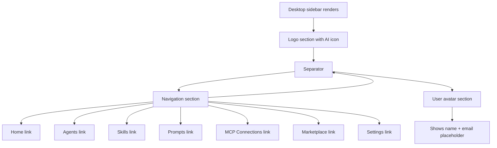

# Task 004 - Create sidebar component

## Reference

Plan document:

docs/plans/plan-age-1-app-shell.md

Relevant section:

Operation 4: Create sidebar component

---

## Description

Create the desktop sidebar component in `components/layout/sidebar.tsx`. This is the main persistent sidebar visible on screens >= 768px. It includes:

- Logo/branding section at the top ("AI Agent Studio" with "AI" icon)
- Navigation section with all 7 nav items rendered using `SidebarNavItem`
- User profile section at the bottom (avatar + name + email)
- Visual separators between sections

The sidebar uses fixed positioning on desktop (`md:fixed md:w-60`) and is hidden on mobile (`hidden md:flex`). All styling uses semantic CSS tokens from existing CSS variables.

---

## Acceptance Criteria

- File `components/layout/sidebar.tsx` exists
- Component is a `"use client"` component
- Defines `navItems` array with all 7 items from the PRD:
  - Home (`/dashboard`), Agents (`/agents`), Skills (`/skills`)
  - Prompts (`/prompts`), MCP Connections (`/mcp`), Marketplace (`/marketplace`), Settings (`/settings`)
- Uses lucide-react icons: `Home`, `Bot`, `Wrench`, `MessageSquare`, `Plug`, `Store`, `Settings`
- Logo section: 40px square with `bg-sidebar-primary` / text `sidebar-primary-foreground`
- Navigation items rendered via `SidebarNavItem` component (Task 003)
- User section: `Avatar` with `AvatarFallback` containing "U"
- Truncated long names with `truncate` class
- Uses `Separator` between logo/nav and nav/user sections
- Fixed positioning: `md:fixed md:w-60 md:inset-y-0`
- Hidden on mobile: `hidden md:flex`
- Uses semantic tokens: `bg-sidebar`, `text-sidebar-foreground`, `border-sidebar-border`
- Uses `from "@/components/ui/separator"` and `from "@/components/ui/avatar"`

---

## Out Of Scope

- Mobile sidebar overlay (Task 005)
- Auth-aware layout wrapper (Task 007)
- Top bar component (Task 006)

---

## Domain

### Sidebar Navigation

The sidebar is the primary navigation surface for authenticated users. It presents all seven MVP section routes in a persistent, fixed-position panel. The sidebar communicates the product's identity ("AI Agent Studio") through its branding section and provides consistent access to all sections. The user avatar at the bottom creates a visual container for the sidebar and serves as an entry point for future account-related features.

**Implementation scope:**

Single component with static data. Icons are statically imported from lucide-react. Layout and colors use existing CSS variables.

---

## Graph

