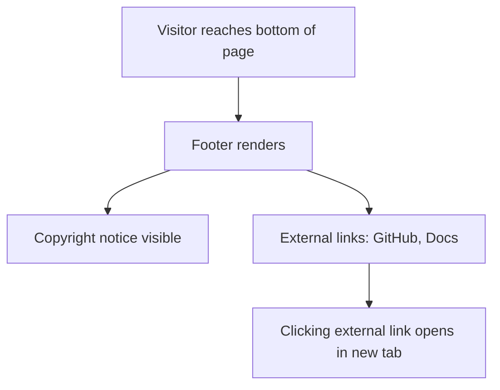

# Task 004 - Footer Section Component

## Reference

Plan document:

[docs/plans/plan-001-landing-page.md](../plans/plan-001-landing-page.md)

Relevant section:

Operation 4: Create Footer Section

---

## Description

Create the Footer section component as a Server Component in `components/landing/footer.tsx`. This is a minimal footer containing the product name, copyright notice, and placeholder external links (GitHub, Docs).

**Responsibility:** One component providing the bottom-of-page footer with legal and external link references.

---

## Acceptance Criteria

- File `components/landing/footer.tsx` exists and exports `Footer` as a named function returning `React.ReactNode`
- No `"use client"` directive — component is a Server Component
- Contains copyright text: "© 2026 AI Agent Studio" (or similar year/product name)
- Contains at least two external links: GitHub and Docs
- External links use `target="_blank"` with `rel="noopener noreferrer"` for security
- Links styled with muted foreground, hover to foreground, `transition-colors`
- Desktop layout: horizontal flex row (copyright left, links right)
- Mobile layout: vertical stack (copyright above, links below)
- Footer has top border (`border-t border-border`) and background token (`bg-background`)
- `py-8` vertical padding, `max-w-6xl` content width
- Wraps in semantic `<footer>` tag
- Uses `@/*` path alias for all local imports
- Passes `npm run build` with no errors

---

## Out Of Scope

- Newsletter signup form
- Social media icons
- Multi-column footer navigation
- Sitemap or product links
- Dark mode specific styling

---

## Domain

### Footer

The footer is the standard bottom-of-page anchor that provides legal attribution and external references. It is minimal by design — placeholder external links are sufficient for MVP.

**Importance:** Every public-facing page needs a footer for legal attribution and a professional finish. Even a minimal footer signals product maturity.

**Implementation scope:** This task creates only the Footer component with placeholder links and styling. No props, no state, no client-side behavior.

---

## Graph

