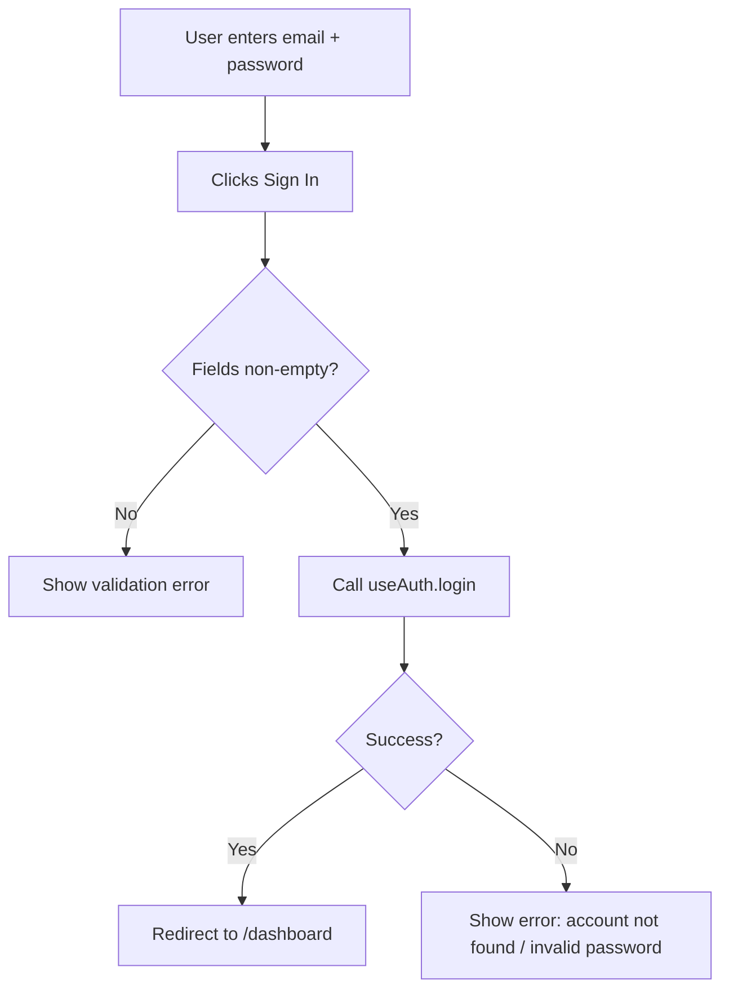

# Task 004 - LoginForm component

## Reference

Plan document:

docs/plans/plan-002-authentication.md

Relevant sections:

- Operations: LoginUser (input, output, steps, edge cases)
- Components: `components/auth/login-form.tsx`
- Norms: Forms display errors via state, not toast

---

## Description

Create `components/auth/login-form.tsx` — a controlled form with email and password fields. Uses shadcn Input + Label, project Button, and a "Sign in" action. Uses the `useAuth()` hook. Shows validation errors inline. Renders a mock GitHub OAuth button.

---

## Acceptance Criteria

- Exports `LoginForm` component
- `'use client'` directive present
- Fields: email (type="email", required), password (type="password", required)
- Uses `Input` from `@/components/ui/input` and `Label` from `@/components/ui/label`
- Uses `Button` from `@/components/ui/button`
- Calls `useAuth().login(email, pwd)` on submit
- On success: `router.push('/dashboard')`
- On error: sets `error` state, displays it in the form
- Shows loading state while login is in progress
- Validates empty fields client-side before submit
- Shows "No account? Sign up" link
- Mock GitHub OAuth button present (calls `useAuth().login` with mock data)

---

## Out Of Scope

- Signup form (Task 005)
- OAuth button styling (Task 006)
- Page layout wrapper (Task 008)

---

## Domain

### Login

The action of authenticating an existing user. Takes email+password. The form validates locally (non-empty fields), then calls the auth context. On success, navigates to `/dashboard`. On failure, displays the error message inline.

---

## Graph

Login form interaction:

