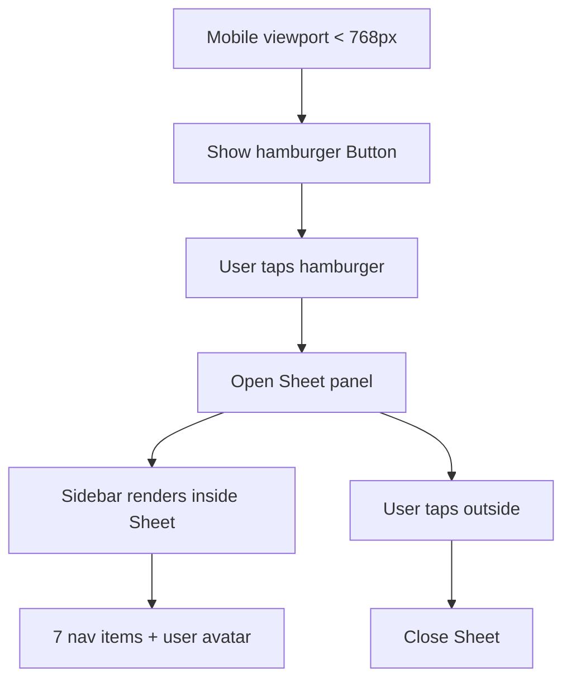

# Task 005 - Create mobile sidebar component

## Reference

Plan document:

docs/plans/plan-age-1-app-shell.md

Relevant section:

Operation 5: Create mobile sidebar component

---

## Description

Create the mobile sidebar overlay component in `components/layout/mobile-sidebar.tsx`. On screens below 768px, the desktop sidebar (Task 004) is hidden and this component provides an alternative slide-out navigation panel using shadcn's `Sheet` component.

The component renders a hamburger button with a `Menu` icon that opens a left slide-in sheet containing the full sidebar. Sheet closes when the user taps outside or navigates to a different route.

This task also installs the `Sheet` component (prerequisite not covered in Task 001).

---

## Acceptance Criteria

- File `components/layout/mobile-sidebar.tsx` exists
- Component is a `"use client"` component
- Installs `sheet` component via `npx shadcn@latest add sheet`
- Renders `Button` with `Menu` icon from lucide-react
- Button has `variant="ghost"`, `size="icon"`, and `md:hidden` (visible only on mobile)
- On click, opens a `Sheet` with `side="left"` and `className="w-60 p-0"`
- Sheet wraps the `Sidebar` component from Task 004
- Sheet includes `SheetTitle` with `className="sr-only"` for accessibility
- Uses `useState` for open/close state managing the Sheet
- Sheet overlay dismisses on outside tap

---

## Out Of Scope

- Desktop sidebar layout (Task 004)
- Top bar component (Task 006)
- Full layout integration (Task 007)

---

## Domain

### Mobile Navigation

On mobile screens, the persistent sidebar would consume too much viewport width. Instead, a hamburger button (visible only on mobile via `md:hidden`) opens a slide-out sheet that contains the same sidebar navigation. This preserves the same navigation structure and interactions while fitting the constrained screen space. Accessibility is maintained through `SheetTitle` for screen readers and focus trap managed by the `Sheet` component.

**Implementation scope:**

Install `Sheet` component. Create mobile sidebar wrapper. Import and embed the desktop sidebar.

---

## Graph

