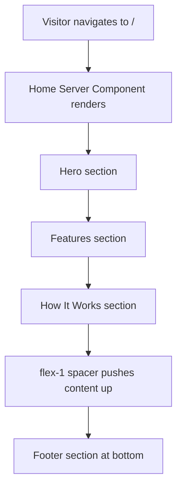

# Task 005 - Replace Root Page with Landing Composition

## Reference

Plan document:

[docs/plans/plan-001-landing-page.md](../plans/plan-001-landing-page.md)

Relevant section:

Operation 5: Replace Root Page

---

## Description

Replace the contents of `app/page.tsx` with a landing page that composes the four existing landing section components (Hero, Features, HowItWorks, Footer) from `components/landing/`. All existing boilerplate (Vercel links, Next.js logo image, static text) must be removed.

**Responsibility:** Wire the four independently built section components into the root page, producing a complete landing page that fills the viewport.

---

## Acceptance Criteria

- File `app/page.tsx` is completely replaced (no residual boilerplate remains)
- Exports a default function `Home()` returning `React.ReactNode`
- No `"use client"` directive — Server Component
- Imports all four components:
  ```
  import { Hero } from "@/components/landing/hero"
  import { Features } from "@/components/landing/features"
  import { HowItWorks } from "@/components/landing/how-it-works"
  import { Footer } from "@/components/landing/footer"
  ```
- Layout structure:
  - Outer wrapper: `flex flex-col min-h-screen bg-background`
  - Sections render in order: Hero → Features → HowItWorks
  - `div` with `flex-1` between HowItWorks and Footer (pushes footer to bottom)
  - Footer renders last
- No unused imports
- No images (`next/image` imports removed)
- No Vercel/Next.js template links
- Page renders all four sections in correct order when loaded
- Passes `npm run build` with no errors
- Passes `npm run lint` with no warnings

---

## Out Of Scope

- Layout metadata (`title`, `description`) — handled by `app/layout.tsx`
- Navigation bar / header (out of plan scope)
- Authentication guard on root route
- Responsive navigation menu (out of scope)

---

## Domain

### Root Landing Page

The root page (`/`) is the entry point for all unauthenticated visitors. It composes the four section components vertically into a single cohesive page. The `flex-1` spacer between content and footer ensures the footer sits at the bottom of the viewport regardless of content height.

**Importance:** This is the front door of the application. Every visitor lands here first, and it must render the complete landing experience without requiring authentication or a layout shell.

**Implementation scope:** This task composes already-built components. No new component logic — only import statements and structural wrapping.

---

## Graph

