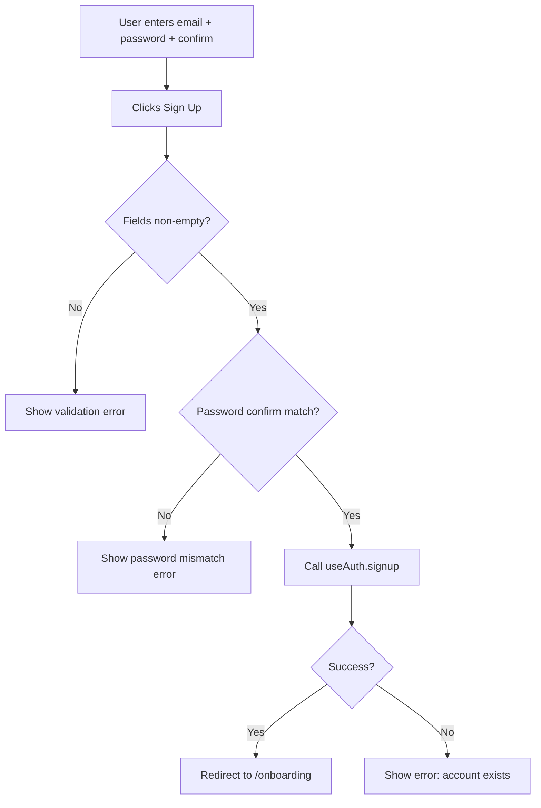

# Task 005 - SignupForm component

## Reference

Plan document:

docs/plans/plan-002-authentication.md

Relevant sections:

- Operations: SignupUser (input, output, steps, edge cases)
- Components: `components/auth/signup-form.tsx`

---

## Description

Create `components/auth/signup-form.tsx` — a controlled form with email, password, and confirm password fields. Uses the `useAuth()` hook. Shows validation errors inline. Renders a mock GitHub OAuth button. On success, redirects to `/onboarding`.

---

## Acceptance Criteria

- Exports `SignupForm` component
- `'use client'` directive present
- Fields: email (type="email", required), password (type="password", required), confirmPassword (type="password", required)
- Uses `Input` from `@/components/ui/input` and `Label` from `@/components/ui/label`
- Uses `Button` from `@/components/ui/button`
- Validates confirm password matches password before submit
- Calls `useAuth().signup(email, pwd, confirmPwd)` on submit
- On success: `router.push('/onboarding')`
- On error: sets `error` state, displays it inline
- Shows loading state while signup is in progress
- "Already have an account? Sign in" link
- Mock GitHub OAuth button present
- Password min 8 chars validated client-side

---

## Out Of Scope

- Login form (Task 004)
- OAuth button styling (Task 006)
- Page layout wrapper (Task 008)

---

## Domain

### Signup

The action of creating a new user account. The form collects email, password, and password confirmation. Validates all fields locally before calling the auth context. On success, the user is created and redirected to onboarding (`/onboarding`).

Domain rules enforced: password must be >= 8 characters, confirm must match, email must be unique.

---

## Graph

Signup form interaction:

