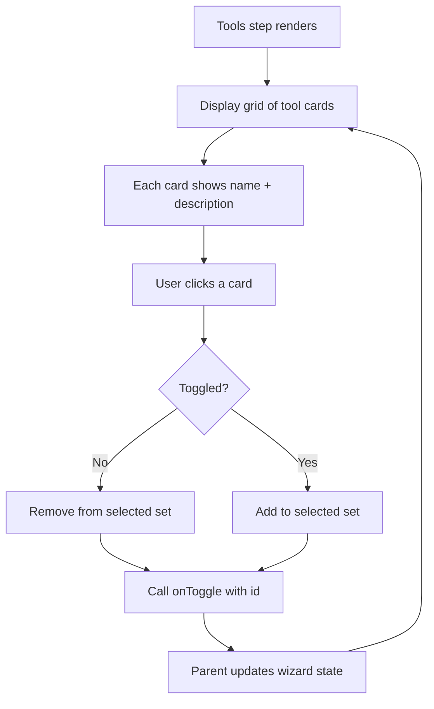

# Task 006 — Tools Step Component

## Reference

Plan document:

docs/plans/plan-AGE-3-agent-builder-wizard.md

Relevant section:

Operation 6: ToolsStep Component

---

## Description

Implement Step 2 of the wizard: a multi-select grid of MCP tools (GitHub, Linear, Notion, Slack, Jira, Figma, Docker, AWS, GCP, Azure) that the user can toggle on/off.

Each tool is displayed as a card with name and description. Users click a card to toggle selection, and selected tools receive visual feedback.

---

## Acceptance Criteria

- `components/agent/wizard/ToolsStep.tsx` exists
- Has `"use client"` directive
- Accepts props: `selectedTools: string[]`, `onToggle: (toolId: string) => void`
- Defines an internal `TOOL_CANDIDATES` array with 10 tools: GitHub, Linear, Notion, Slack, Jira, Figma, Docker, AWS, GCP, Azure. Each has: `id`, `name`, `description`, `category`, optional `icon`
- Renders tools in a responsive grid: `grid grid-cols-1 sm:grid-cols-2 lg:grid-cols-3 gap-4`
- Each tool is a Card component showing name, description, and a checkbox or selection indicator
- Clicking a card calls `onToggle` with the tool id
- Selected tools have visual feedback (border color, background, or icon showing check)
- Unselected tools look muted
- Tool descriptions are truncated to 2 lines with `line-clamp-2`
- Uses `cn()` for conditional classes
- Uses semantic colors for selection state
- Has no maximum number of selections (all can be selected)
- Zero selections is valid (agent may work with no external tools)
- Uses `gap-*` for spacing
- Imports shadcn `Card`, `Badge` as needed

---

## Out Of Scope

- Tool detail modals
- Tool configuration (each tool is just a toggle)
- Searching/filtering tools
- Category-based filtering

---

## Domain

### MCP Tools

MCP (Model Context Protocol) tools that an agent can call. The wizard provides a curated set of common MCP integrations. Tools augment what an agent can do by giving it access to external systems.

Importance:

Different agents need different tool access. The user explicitly chooses which systems each agent should be able to interact with.

### Tool Selection

A boolean toggle per tool. The wizard collects which tools to include in the generated agent.

---

## Graph

---

## Files

| Action | Path |
|--------|------|
| Create | `components/agent/wizard/ToolsStep.tsx` |