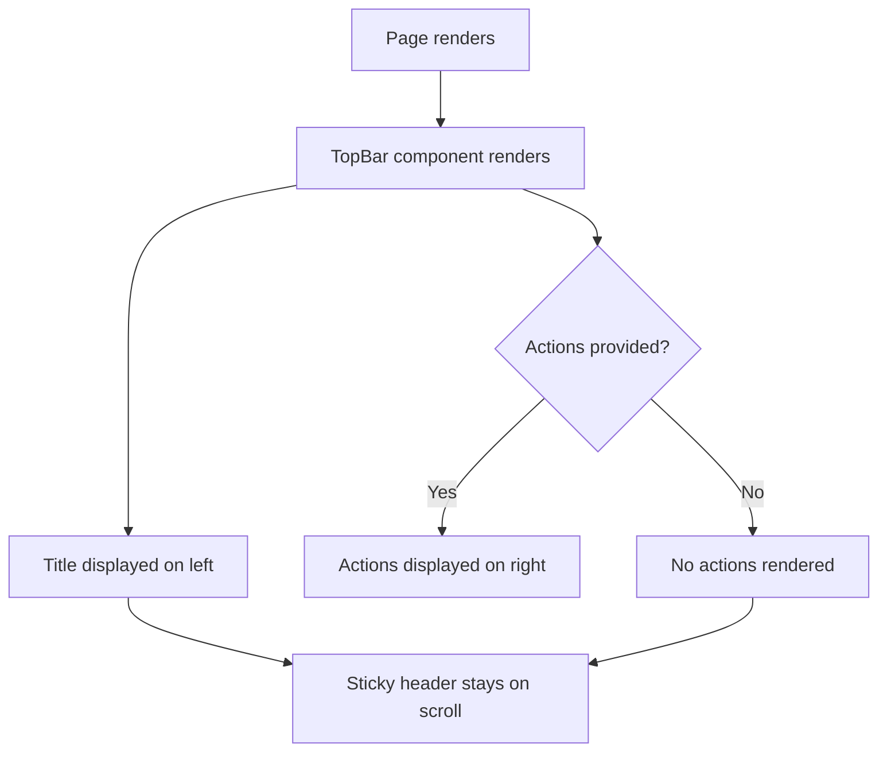

# Task 006 - Create top bar component

## Reference

Plan document:

docs/plans/plan-age-1-app-shell.md

Relevant section:

Operation 6: Create top bar component

---

## Description

Create the `TopBar` component in `components/layout/top-bar.tsx`. This is a sticky page header that renders above the main content area of each dashboard page. It displays the page title and optionally accepts an `actions` slot for page-specific buttons (e.g., "Create Agent" button).

The top bar is sticky (`sticky top-0 z-10`) so it remains visible while scrolling through content. It uses semantic CSS tokens for colors and borders.

---

## Acceptance Criteria

- File `components/layout/top-bar.tsx` exists
- Component is a `"use client"` component
- Accepts `title: string` prop (required)
- Accepts optional `actions?: React.ReactNode` prop
- Title renders as `<h1>` with `text-lg font-semibold text-foreground`
- Actions slot renders inside a `
` with `flex items-center gap-2`
- Header has sticky positioning: `sticky top-0 z-10`
- Uses semantic tokens: `bg-background`, `border-border`, `text-foreground`
- Horizontal padding: `px-6 py-4`
- When `actions` is `undefined`, the actions container is not rendered

---

## Out Of Scope

- Dashboard layout integration (Task 007)
- Page-specific button implementations (created alongside their pages)
- Mobile-specific top bar behavior (handled in layout)

---

## Domain

### Page Header

The top bar serves as a consistent page-level header across all dashboard pages. It provides page context (title) and an optional action area for primary page actions. The sticky positioning ensures the header stays visible during vertical scrolling, improving navigation context in content-rich pages.

**Implementation scope:**

Single lightweight component. No state, no side effects. Pure presentational component with conditional slot rendering.

---

## Graph

