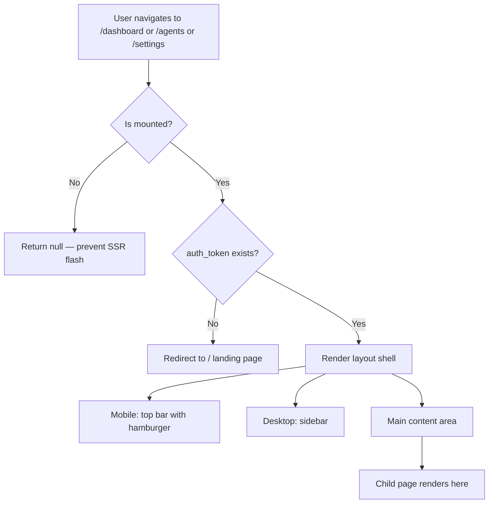

# Task 007 - Create dashboard layout

## Reference

Plan document:

docs/plans/plan-age-1-app-shell.md

Relevant section:

Operation 7: Create dashboard layout (route group layout)

---

## Description

Create the dashboard route group layout at `app/(dashboard)/layout.tsx`. This is the critical orchestration layer that:

1. Implements auth-aware redirect — reads `auth_token` from `localStorage` client-side; redirects to `/` (landing page) if no token exists
2. Renders the desktop sidebar for screens >= 768px (hidden on mobile)
3. Renders the mobile top bar with hamburger button for screens < 768px
4. Wraps child pages in a main content area with `md:ml-60` offset

The layout uses `"use client"` directive and an `isMounted` state to prevent flash-of-wrong-content during SSR hydration. Auth check runs once in `useEffect` via `useRouter().push()`.

This task creates the route group structure: `app/(dashboard)/layout.tsx` and `app/(dashboard)/dashboard/` directory.

---

## Acceptance Criteria

- File `app/(dashboard)/layout.tsx` exists with `"use client"` directive
- Creates route group directory `app/(dashboard)/dashboard/`
- Layout is `"use client"` component
- Auth check: reads `localStorage.getItem("auth_token")` in `useEffect`
- If no token: redirects to `/` using `useRouter().push("/")`
- Uses `isMounted` state pattern — `useState(false)` default, set `true` in `useEffect`, return `null` while not mounted
- Renders mobile header on small screens: `md:hidden`, sticky top-0, with `MobileSidebar` button
- Renders `Sidebar` component for desktop (hidden on mobile via `hidden md:flex`)
- Main content area: `<main className="md:ml-60 min-h-screen">` with `{children}`
- Imports: `useEffect`, `useState` from `react`; `useRouter` from `next/navigation`; `Sidebar` from `@/components/layout/sidebar`; `MobileSidebar` from `@/components/layout/mobile-sidebar`
- Uses semantic tokens: `bg-background`, `border-border`, `text-foreground`

---

## Out Of Scope

- Dashboard page content (Task 008)
- Placeholder pages (Task 009)
- Landing page modifications (out of scope — `app/page.tsx` kept as-is)

---

## Domain

### Auth-Aware App Shell

The `(dashboard)` route group isolates all authenticated routes from the public landing page. Its layout acts as a gatekeeper: if no `auth_token` exists in `localStorage`, the user is redirected back to the landing page. This is a placeholder auth mechanism — real auth will be replaced later. The layout also orchestrates responsive rendering: desktop shows the persistent sidebar, mobile shows a collapsible overlay.

**Implementation scope:**

Layout component with auth guard + responsive composition of sidebar and content area. No page content itself.

---

## Graph

