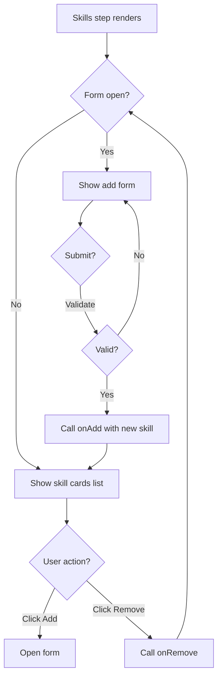

# Task 007 — Skills Step Component

## Reference

Plan document:

docs/plans/plan-AGE-3-agent-builder-wizard.md

Relevant section:

Operation 7: SkillsStep Component

---

## Description

Implement Step 3 of the wizard: an interface to select or create skills for the agent. Shows a list of currently selected skills as cards, with an inline form to add new skills.

Each skill has a name, description, and instructions. Users can add, edit, and remove skills.

---

## Acceptance Criteria

- `components/agent/wizard/SkillsStep.tsx` exists
- Has `"use client"` directive
- Accepts props: `skills: Skill[]`, `onAdd: (skill: Skill) => void`, `onRemove: (skillId: string) => void`, `onUpdate: (skillId: string, updates: Partial<Skill>) => void`
- Renders existing skills as Cards, each showing name, description, and a remove button
- Each skill has an "Add Skill" inline form with:
  - Name input (`Field` + `Input` — required)
  - Description textarea (`Field` + `Textarea` — required)
  - Instructions textarea (`Field` + `Textarea` — optional)
  - "Add Skill" `Button`
- Uses `useState` to toggle form visibility (open/closed)
- Calls `onAdd` with a new `Skill` object when form is submitted
- Calls `onRemove` with skill id when remove button is clicked
- Validates form before submit: name and description are non-empty
- Duplicate skill names are allowed (skills can have the same name)
- Zero skills is valid (agent works without specific skills)
- Uses shadcn `FieldGroup`, `Field`, `FieldLabel`, `Input`, `Textarea`, `Button`, `Card`
- Uses `gap-*` for spacing
- Uses `cn()` for conditional classes
- Uses semantic colors
- Form resets after successful submission (name, description, instructions cleared)

---

## Out Of Scope

- Drag-and-drop reordering of skills
- Copying skills between agents
- Built-in skill library (skills are user-created, not pre-defined)

---

## Domain

### Agent Skill

A specialized capability with name, description, and detailed instructions. Skills teach the agent HOW to do something specific, while MCP TOOLS give it access to external systems.

Importance:

Skills provide the behavioral layer — the AI agent follows skill instructions to produce higher-quality output in specific domains (code review, testing, documentation, etc.).

### Skill Creation

Skills are created inline within the wizard, not from a pre-built library. This allows users to create hyper-specific skills tailored to their workflow.

---

## Graph

---

## Files

| Action | Path |
|--------|------|
| Create | `components/agent/wizard/SkillsStep.tsx` |