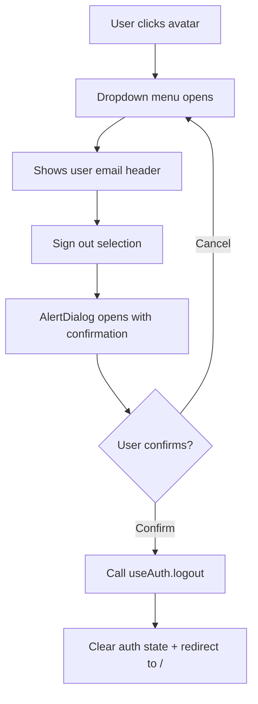

# Task 007 - UserMenu component

## Reference

Plan document:

docs/plans/plan-002-authentication.md

Relevant sections:

- Components: `components/layout/user-menu.tsx`
- Scope: Sidebar shows user email, user menu dropdown with Sign Out
- shadcn: dropdown-menu, alert-dialog (installed in Task 001)

---

## Description

Create `components/layout/user-menu.tsx` — a dropdown menu triggered by clicking the user avatar in the sidebar. Shows the user's email as the header. Has a "Sign out" option that opens a confirmation dialog (AlertDialog) before calling `useAuth().logout()`.

---

## Acceptance Criteria

- Exports `UserMenu` component
- `'use client'` directive present
- Triggered by clicking an avatar/icon area in the sidebar
- Uses `DropdownMenu` from `@/components/ui/dropdown-menu`
- Shows user email from `useAuth().user?.email` in menu header
- "Sign out" menu item is present
- Clicking sign out opens `AlertDialog` (from `@/components/ui/alert-dialog`)
- AlertDialog has Yes/Confirm and Cancel actions
- Confirm calls `useAuth().logout()`
- Cancel dismisses dialog without action
- Accepts className prop
- Uses Avatar from `@/components/ui/avatar` for trigger

---

## Out Of Scope

- Sidebar layout (Task 013 — sidebar modification)
- Logout page flow (handled by AuthProvider redirect)
- Any account settings menu items

---

## Domain

### UserMenu

A dropdown triggered by the sidebar avatar. It displays the current user's email and offers a sign-out action. The sign-out is guarded by an AlertDialog confirmation to prevent accidental logouts. On confirmation, it calls `useAuth().logout()` which clears all auth data and redirects to `/`.

---

## Graph

User menu and sign-out flow:

