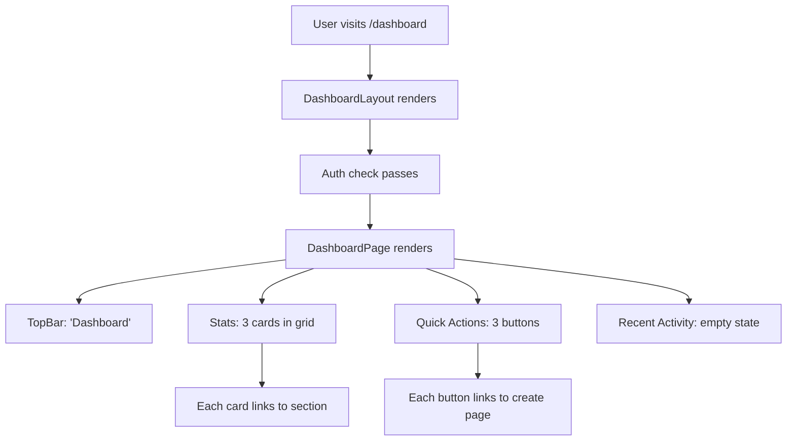

# Task 008 - Create dashboard home page

## Reference

Plan document:

docs/plans/plan-age-1-app-shell.md

Relevant section:

Operation 8: Create dashboard page

---

## Description

Create the dashboard home page at `app/(dashboard)/dashboard/page.tsx`. This is the landing page inside the authenticated shell, displayed at `/dashboard`. It is a Server Component (no `"use client"` needed) that renders:

1. **TopBar** with "Dashboard" title
2. **Stats cards** (3 cards in responsive grid: Agents, Skills, Prompts) — each card shows count "0", an icon, and links to the corresponding placeholder route
3. **Quick Actions** section with outline buttons linking to `/agents/new`, `/skills/new`, `/prompts/new`
4. **Recent Activity** section with an empty state card showing "No recent activity"

The stats grid is responsive: 1 column on mobile, 2 on tablet, 3 on desktop.

---

## Acceptance Criteria

- File `app/(dashboard)/dashboard/page.tsx` exists
- Component is a Server Component (no `"use client"` directive)
- Renders `TopBar` with title "Dashboard"
- Stats array contains 3 items: Agents (Bot icon), Skills (Wrench icon), Prompts (MessageSquare icon)
- Each stat count is `0` (placeholder)
- Each stat card is wrapped in `Link` to its route (`/agents`, `/skills`, `/prompts`)
- Cards use `Card` composition: `CardHeader`, `CardTitle`, `CardContent`
- Card has hover effect: `hover:bg-accent/50 transition-colors cursor-pointer`
- Quick Actions section has heading "Quick Actions"
- 3 quick action buttons: "Create Agent" (`/agents/new`), "Create Skill" (`/skills/new`), "Create Prompt" (`/prompts/new`)
- Buttons use `Button` with `variant="outline"` and `asChild` + `Link`
- Icons in buttons use `data-icon="inline-start"` per shadcn convention
- Recent Activity section has heading "Recent Activity"
- Empty state card shows centered "No recent activity" text with `text-muted-foreground`
- Stats grid: `grid grid-cols-1 sm:grid-cols-2 lg:grid-cols-3 gap-4`
- No client-side data fetching
- Layout: `px-6 py-6 flex flex-col gap-6`

---

## Out Of Scope

- Real data fetching for stats (future task)
- Recent activity data (future task)
- Actual agent/skill/prompt creation pages (placeholder routes only, Task 009)

---

## Domain

### Dashboard

The dashboard is the primary authenticated landing page. It provides a high-level overview of the workspace (placeholder counts), quick navigation to key actions, and an activity feed area (currently empty). The design follows the PRD's requirement for a stats-based home page with placeholder data that will be wired to real APIs later.

**Implementation scope:**

Server component with static data. Uses `TopBar`, `Card`, `Button`, `Link`. No hooks, no client state.

---

## Graph

