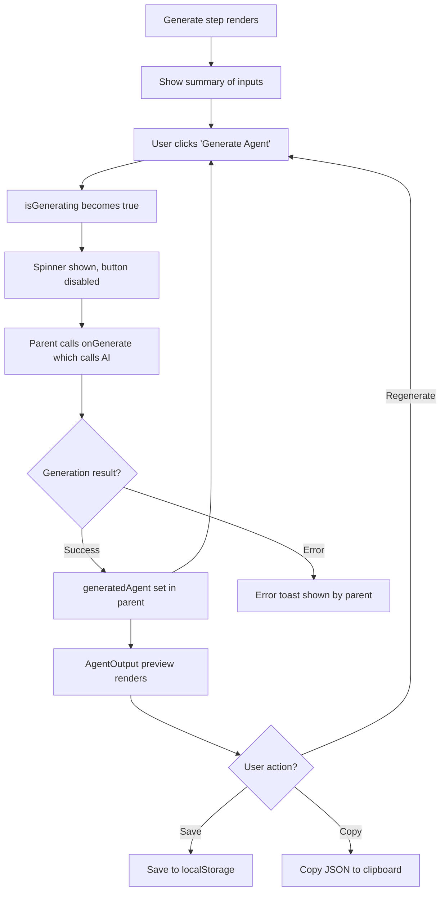

# Task 009 — Generate Step Component

## Reference

Plan document:

docs/plans/plan-AGE-3-agent-builder-wizard.md

Relevant section:

Operation 9: GenerateStep Component

---

## Description

Implement Step 5 of the wizard: the AI generation step. This step shows a summary of previous step inputs, a "Generate Agent" button with loading state, and a preview of the generated agent with save and copy actions.

---

## Acceptance Criteria

- `components/agent/wizard/GenerateStep.tsx` exists
- Has `"use client"` directive
- Accepts props:
  - `wizardState: WizardState`
  - `onGenerate: () => void`
  - `isGenerating: boolean`
  - `generatedAgent?: AgentDefinition`
- Shows a summary section listing: goal (first line), tools selected (count), skills (count), context (first line if present)
- Renders a "Generate Agent" `Button` with:
  - A `Spinner` component during generation (`isGenerating` = true)
  - Button is disabled during generation
  - Button text changes to "Generating..." while active
  - Button is hidden after successful generation
- When `generatedAgent` is present:
  - Renders an `AgentOutput` component showing the generated agent
  - Shows "Save Agent" button that calls `onGenerate` in parent (save handler)
  - Shows "Copy to Clipboard" button that copies the agent JSON to clipboard
  - The Save and Copy buttons appear below the preview
- Uses shadcn `Card`, `Badge`, `Separator`, `Button`, `Spinner`
- Uses `gap-*` for spacing
- Uses `cn()` for conditional classes
- Copy to clipboard uses `navigator.clipboard.writeText` wrapped in try/catch
- Uses semantic colors

---

## Out Of Scope

- Error toast handling (parent provides error state)
- Agent editing from generate step
- Regeneration with different settings
- Download as file

---

## Domain

### Agent Generation

The pivotal step where all user inputs (goal, tools, skills, context) are combined by the AI to produce a complete, structured agent definition.

Importance:

This is the moment where the wizard delivers value. Every previous step builds toward this — the generated agent is the user's actual deliverable.

### Agent Preview

The user reviews the generated agent before saving. The preview lets them decide whether to save, regenerate, or go back and adjust inputs.

---

## Graph

---

## Files

| Action | Path |
|--------|------|
| Create | `components/agent/wizard/GenerateStep.tsx` |