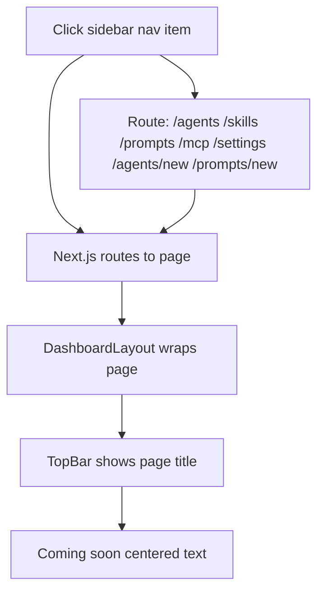

# Task 009 - Create placeholder route pages

## Reference

Plan document:

docs/plans/plan-age-1-app-shell.md

Relevant section:

Operation 9: Create placeholder pages

---

## Description

Create all placeholder pages for the authenticated routes in one batch. Each page follows the same consistent pattern: a `TopBar` with the page's title and a centered "Coming soon" message. These pages ensure every sidebar navigation item routes to a valid page without errors.

The following route pages are created:

| Route | Title |
|-------|-------|
| `/agents` | Agents |
| `/agents/new` | Create Agent |
| `/skills` | Skills |
| `/prompts` | Prompts |
| `/prompts/new` | Create Prompt |
| `/mcp` | MCP Connections |
| `/settings` | Settings |

The Marketplace route (`/marketplace`) is NOT included here — it is listed in the sidebar nav items but its page is out of scope (the plan's Scope Out section explicitly excludes "Marketplace UI").

---

## Acceptance Criteria

- `app/(dashboard)/agents/page.tsx` exists with "Agents" TopBar title + "Coming soon" text
- `app/(dashboard)/agents/new/page.tsx` exists with "Create Agent" TopBar title + "Coming soon" text
- `app/(dashboard)/skills/page.tsx` exists with "Skills" TopBar title + "Coming soon" text
- `app/(dashboard)/prompts/page.tsx` exists with "Prompts" TopBar title + "Coming soon" text
- `app/(dashboard)/prompts/new/page.tsx` exists with "Create Prompt" TopBar title + "Coming soon" text
- `app/(dashboard)/mcp/page.tsx` exists with "MCP Connections" TopBar title + "Coming soon" text
- `app/(dashboard)/settings/page.tsx` exists with "Settings" TopBar title + "Coming soon" text
- All pages import `TopBar` from `@/components/layout/top-bar`
- All pages are Server Components (no `"use client"`)
- All pages render centered placeholder text with `text-muted-foreground`
- Placeholder text is "Coming soon"

---

## Out Of Scope

- Marketplace page (`/marketplace`) — not in scope per plan's "Scope Out" section
- Actual content for any of these pages
- Forms, data displays, or navigation within these pages

---

## Domain

### Placeholder Routes

These pages ensure the entire navigation structure works before real feature implementation begins. Each page follows a uniform pattern so developers can quickly swap in real content later. The "Coming soon" placeholder provides visual confirmation that route navigation works without 404 errors.

**Implementation scope:**

7 small pages with identical structure. Each is a Server Component importing only `TopBar`.

---

## Graph

