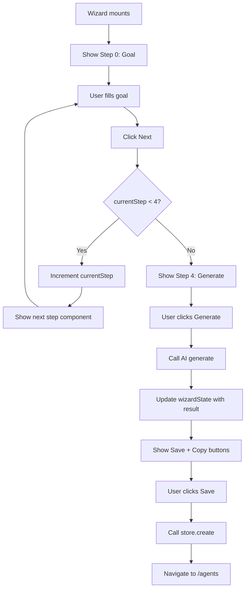

# Task 010 — Agent Wizard Container

## Reference

Plan document:

docs/plans/plan-AGE-3-agent-builder-wizard.md

Relevant section:

Operation 10: AgentWizard Component

---

## Description

Implement the main wizard container that orchestrates all step components, manages wizard state, handles navigation between steps, and coordinates saving the created agent to localStorage.

---

## Acceptance Criteria

- `components/agent/AgentWizard.tsx` exists
- Has `"use client"` directive
- Accepts optional prop: `onSave?: (agent: Agent) => void`
- Imports all step components (`GoalStep`, `ToolsStep`, `SkillsStep`, `ContextStep`, `GenerateStep`) and `ProgressIndicator` and `AgentOutput`
- Uses `useState` to manage `WizardState` with initial: `currentStep: 0`, `goal: ""`, `selectedTools: []`, `skills: []`, `context: ""`, `generatedAgent: undefined`
- Renders `ProgressIndicator` at the top with all 5 step labels
- Renders the current step component based on `currentStep` (0-4)
- Renders a navigation bar at the bottom with:
  - "Back" button (disabled on step 0)
  - "Next" button (disabled based on step validation)
  - "Generate Agent" button on step 4 (or re-generate button after generation)
  - "Save Agent" button only shown after successful generation
  - "Discard" or "Cancel" button on step 4 after generation
- Step validation rules:
  - Step 0 → Next enabled only when `goal` is non-empty (trimmed)
  - Step 1 → Next always enabled (zero tools allowed)
  - Step 2 → Next always enabled (zero skills allowed)
  - Step 3 → Next always enabled (empty context allowed)
  - Step 4 → "Generate" triggers generation, "Save" triggers save
- Calling `generateAgent()` on step 4 calls the mock generator, updates wizard state with result
- Calling save on step 4 calls `store.create()` with agent data and navigates to `/agents` after save
- On save success: navigates to `/agents/` using `useRouter` from `next/navigation`
- Step changes use controlled state (no direct mutation of existing step state on navigation)
- Back button goes to previous step (index - 1), disabled on step 0
- Uses shadcn `Button`, `Separator`, and layout components
- Uses `gap-*` for spacing
- Uses `cn()` for class merging
- Wizard state reset on navigation away (implicit — component re-mounts fresh)

---

## Out Of Scope

- Undo/redo step history
- Unsaved changes warning dialog
- Drag-and-drop step reordering
- Per-step progress persistence (localStorage draft)

---

## Domain

### Wizard Container

The orchestrator that manages the full lifecycle of agent creation — from first input to final save. It owns the state and coordinates with the store for persistence.

Importance:

This is the main entry point for the builder feature. All user interactions funnel through this component, making it the single source of truth for creation flow.

### Step Navigation

Wizards require ordered progression. The wizard controls whether each step's "Next" button is enabled based on its validation rules and coordinates the step state changes.

---

## Graph

---

## Files

| Action | Path |
|--------|------|
| Create | `components/agent/AgentWizard.tsx` |