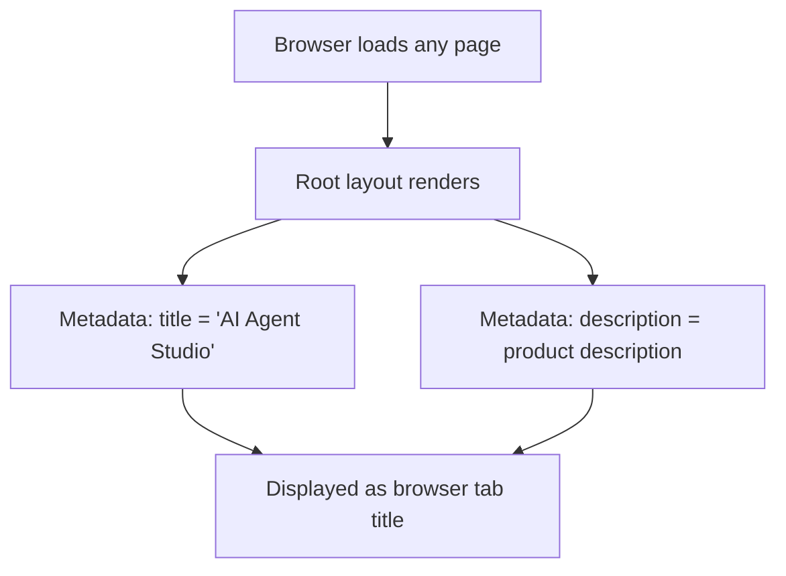

# Task 010 - Update root layout metadata

## Reference

Plan document:

docs/plans/plan-age-1-app-shell.md

Relevant section:

Operation 10: Update root layout metadata

---

## Description

Update the root layout metadata in `app/layout.tsx` to reflect the product's actual identity. This changes the `<title>` from "Create Next App" to "AI Agent Studio" and the `<description>` from the boilerplate "Generated by create next app" to the PRD-aligned description: "The operating system for AI developers to design, generate, manage, share, and execute AI agents, skills, and prompts."

This is a minimal change — only the metadata object is modified. All other layout code (fonts, html classes, body structure) remains untouched.

---

## Acceptance Criteria

- File `app/layout.tsx` is modified
- `metadata.title` is `"AI Agent Studio"`
- `metadata.description` is `"The operating system for AI developers to design, generate, manage, share, and execute AI agents, skills, and prompts."`
- No other changes to `layout.tsx` (fonts, html, body remain identical)
- `npm run build` still passes after changes
- `npm run lint` still passes after changes

---

## Out Of Scope

- Changes to layout.tsx body structure or font configuration
- Changes to any other file
- Changes to app/page.tsx (landing page kept as-is per plan)

---

## Domain

### Product Identity

The root layout metadata controls the tab title and browser heading for all pages. Updating it establishes the product name ("AI Agent Studio") and provides a meaningful SEO description. This is the foundation branding that every page in the application inherits.

**Implementation scope:**

Two property changes to the metadata export in `app/layout.tsx`. No structural changes.

---

## Graph

