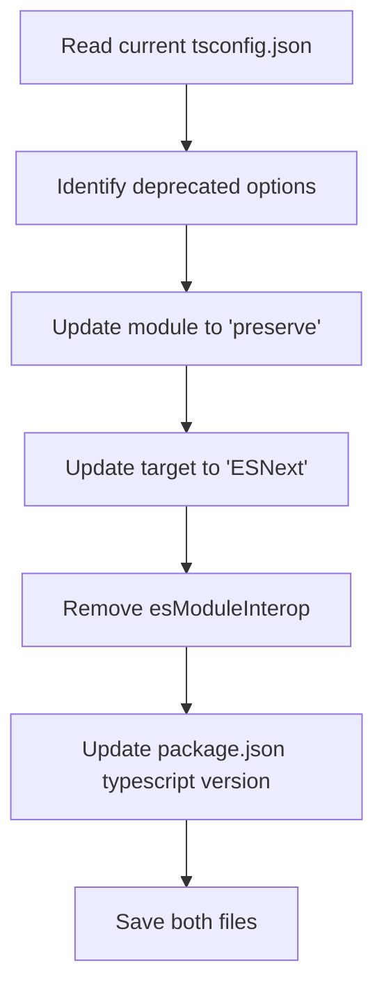

# Task 010 — Upgrade TypeScript to v7 and update tsconfig.json

## Reference

Plan: [plan-022-migrate-nextjs-163-typescript-7.md](../../plans/plan-022-migrate-nextjs-163-typescript-7.md)

Relevant section: Phase 2 — TypeScript 7 Upgrade

---

## Description

Upgrade the TypeScript dependency from `^5` to `^7.0` (Go-based compiler) and update `tsconfig.json` to remove deprecated compiler options that are errors in TypeScript 7.

TypeScript 7 is a Go rewrite (`typescript-go`) that enforces stricter defaults. The following options must be removed or changed:
- `"module": "esnext"` → `"module": "preserve"` (bundler mode recommended)
- `"target": "ES2017"` → `"target": "ESNext"` (recommended for TS7)
- `"esModuleInterop": true` → remove entirely (enabled by default in TS7, no longer a valid option)

All other existing options (`strict`, `moduleResolution`, `isolatedModules`, `jsx`, etc.) remain valid.

---

## Acceptance Criteria

- [ ] `package.json` has `"typescript": "^7.0"` in devDependencies
- [ ] `tsconfig.json` has `"module": "preserve"` (not `"esnext"`)
- [ ] `tsconfig.json` has `"target": "ESNext"` (not `"ES2017"`)
- [ ] `tsconfig.json` no longer contains `"esModuleInterop": true`
- [ ] All other valid compiler options are preserved unchanged (`strict`, `moduleResolution`, `isolatedModules`, `jsx`, `incremental`, `plugins`, `paths`, `include`, `exclude`)
- [ ] `npx tsc --noEmit` after install completes with zero errors

---

## Out Of Scope

- Next.js version upgrade (handled in task-002)
- Lockfile update (handled in task-003)
- Build or runtime verification (handled in task-004)
- Any component or application code changes

---

## Domain

### TypeScript 7 (Go Compiler)

TypeScript 7.0 is a complete rewrite of the TypeScript compiler in Go (`typescript-go`). It provides ~10x faster type checking but removes several options that were deprecated in TS5/TS6. Understanding which options to drop is critical — passing invalid config options causes a build failure before any type checking even runs.

Importance:

The upgrade is the foundational step — the build system won't work until tsconfig.json is compatible with the new compiler.

Implementation scope:

Update the devDependency version and adjust the three deprecated `compilerOptions` entries.

---

## Graph

