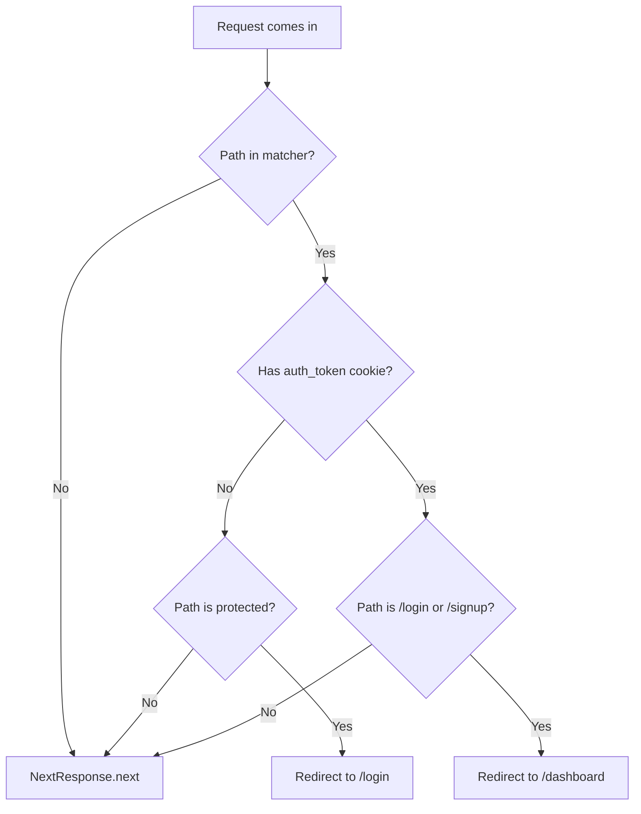

# Task 011 - Proxy route protection

## Reference

Plan document:

docs/plans/plan-002-authentication.md

Relevant sections:

- Operations: ProxyRouteProtection
- Structure: `proxy.ts` → route protection
- Norms: Matcher excludes static assets and API routes

---

## Description

Create `proxy.ts` at the project root — Next.js 16 middleware (proxy) for route protection. Reads `auth_token` cookie to decide if a request is authenticated.

Rules:
- Unauthenticated user hits protected route (`/dashboard/**`, `/onboarding`) → redirect to `/login`
- Authenticated user hits `/login` or `/signup` → redirect to `/dashboard`
- Static assets (`_next/static`, `_next/image`, `*.png`) → skip
- API routes (`/api/**`) → skip
- `/onboarding` allowed for authenticated users even without workspace

---

## Acceptance Criteria

- `proxy.ts` at project root
- `'use client'` NOT present (middleware is server-side)
- Exports `middleware` function matching Next.js middleware signature
- Matcher excludes: `_next/static`, `_next/image`, `*.png`, `api/**`
- Protected list: dashboard routes, `/onboarding`
- Public list: `/login`, `/signup`, `/` (landing page always accessible)
- No cookie → redirect to `/login` for protected routes
- Cookie exists → redirect to `/dashboard` for `/login` and `/signup`
- `/onboarding` accessible if user is authenticated (with or without workspace)
- Returns `NextResponse.redirect()` on redirect, `NextResponse.next()` on pass-through

---

## Out Of Scope

- Auth store function calls (store is client-only, proxy uses cookies only)
- Cookie value creation (handled by auth store — proxy only reads)

---

## Domain

### Proxy (Route Protection)

The proxy is the server gatekeeper. It sees a request coming in and decides: can this user see this page? It doesn't know about the user object — it only checks whether the `auth_token` cookie exists. If the user has a cookie, they're authenticated. If not, they're not.

Protected routes (require cookie): `(dashboard)/*`, `/onboarding`
Public routes (always accessible): `/`, `/login`, `/signup`

The proxy redirects rather than returning error pages — clean UX, correct pattern.

---

## Graph

Proxy decision flow:

