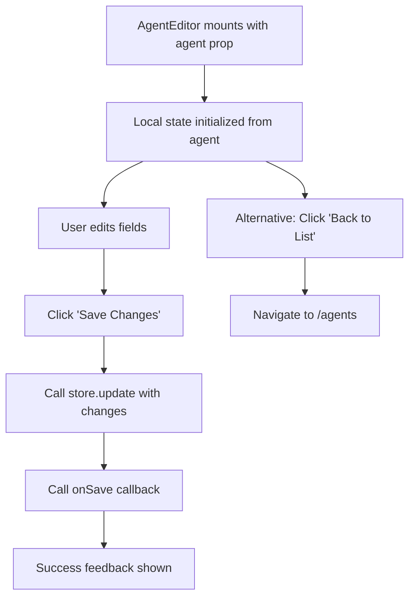

# Task 013 — Agent Editor Component

## Reference

Plan document:

docs/plans/plan-AGE-3-agent-builder-wizard.md

Relevant section:

Operation 13: AgentEditor Component

---

## Description

Implement the full agent editor form that allows editing an existing agent's fields. Used on the `/agents/[id]` page. Renders all agent fields in editable form fields with a local edit buffer that commits to the store on save.

Heavily inspired by the existing `PromptEditor` component in `components/prompt/PromptEditor.tsx`.

---

## Acceptance Criteria

- `components/agent/AgentEditor.tsx` exists
- Has `"use client"` directive
- Accepts props: `agent: Agent`, `onSave?: (agent: Agent) => void`
- Imports `FieldGroup`, `Field`, `FieldLabel`, `Input`, `Textarea`, `Button`, `AgentOutput`
- Imports `Agent` type from `@/lib/agents/types` and `store` from `@/lib/agents/store`
- Uses `useState` for local edit buffer (initializes from agent prop)
- Renders editable fields:
  - Name input (`Field` + `Input`)
  - Description textarea (`Field` + `Textarea`)
  - Model select (`Field` + `Select` — shadcn Select component — with options like "claude-sonnet-4-20250514", "gpt-4", "gpt-4o")
  - System prompt textarea (`Field` + `Textarea`)
- Tools list displayed as read-only badges (not directly editable in editor — tools are set via the wizard)
- Skills list displayed as read-only badges or small cards
- "Save Changes" `Button` that:
  - Calls `store.update(id, updates)` with all changed fields
  - Calls `onSave` callback if provided
  - Shows saved feedback
- "Back to List" `Link` or button that navigates to `/agents`
- Local state changes don't persist until "Save Changes" is clicked
- On save: calls store.update, displays success feedback
- Uses shadcn fields, inputs, and textareas with proper `FieldGroup` + `Field` layout
- Uses `gap-*` for spacing
- Uses `cn()` for class merging
- Imports model options as a constant (not hardcoded in component body)

---

## Out Of Scope

- Adding/removing tools from editor (tools are wizard-only for MVP)
- Adding/removing skills from editor (skills are wizard-only for MVP)
- Field-level validation messages
- Real-time save / auto-save

---

## Domain

### Agent Editor

An editable form view of an existing agent. Users can modify the name, description, model, and system prompt after creation.

Importance:

Agents need to be editable after initial creation. The editor lets users refine their agents without re-running the full wizard.

---

## Graph

---

## Files

| Action | Path |
|--------|------|
| Create | `components/agent/AgentEditor.tsx` |