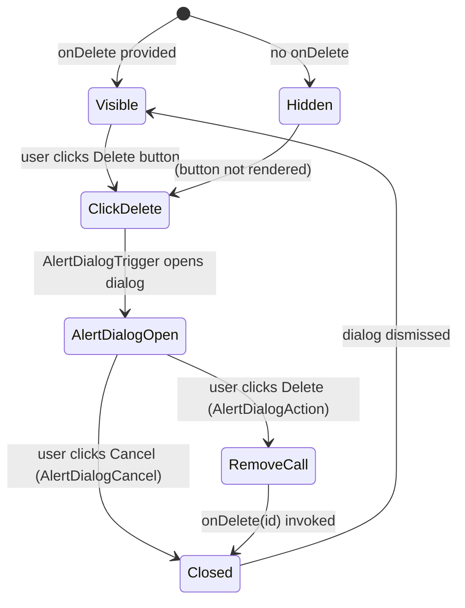

# Task 046 — PromptCard AlertDialog Delete Confirmation

## Reference

Plan document:
`docs/plans/plan-046-add-delete-prompt-functionality.md`

Relevant sections:
- Operation 1: Confirm Prompt Deletion
- R — Requirements (Definition of Done 1–3)
- E — Entities: Prompt
- A — Approach (step 1–2)
- R — Scope In: "Update PromptCard to compose the existing Base UI/shadcn AlertDialog pattern used by AgentCard"

---

## Description

Wrap the existing conditional `Delete` button on `PromptCard` in an `AlertDialog` confirmation dialog, matching the exact pattern used by `AgentCard.tsx`. The Delete action is only rendered when `onDelete` is provided.

The existing `PromptCard` currently renders a plain destructive `Button` that calls `onDelete(prompt.id)` directly on click. This task replaces that direct call with a confirmation dialog flow.

---

## Files

| Action | Path |
|--------|------|
| Modify | `components/prompt/PromptCard.tsx` |
| Read (reference) | `components/agent/AgentCard.tsx` |
| Read (reference) | `components/ui/alert-dialog.tsx` |

---

## Exact Changes Required

### File: `components/prompt/PromptCard.tsx`

1. **Add AlertDialog imports** alongside existing imports:

```tsx
import {
  AlertDialog,
  AlertDialogAction,
  AlertDialogCancel,
  AlertDialogContent,
  AlertDialogDescription,
  AlertDialogFooter,
  AlertDialogHeader,
  AlertDialogTitle,
  AlertDialogTrigger,
} from "@/components/ui/alert-dialog"
```

2. **Replace the direct Delete button** inside the `{onDelete && (` block with the full AlertDialog composition:

```tsx
{onDelete && (
  <AlertDialog>
    <AlertDialogTrigger
      render={
        <Button variant="destructive" size="sm" />
      }
    >
      Delete
    </AlertDialogTrigger>
    <AlertDialogContent>
      <AlertDialogHeader>
        <AlertDialogTitle>Delete prompt</AlertDialogTitle>
        <AlertDialogDescription>
          Are you sure you want to delete &quot;{prompt.title}&quot;? This
          action cannot be undone.
        </AlertDialogDescription>
      </AlertDialogHeader>
      <AlertDialogFooter>
        <AlertDialogCancel>Cancel</AlertDialogCancel>
        <AlertDialogAction
          variant="destructive"
          onClick={() => onDelete(prompt.id)}
        >
          Delete
        </AlertDialogAction>
      </AlertDialogFooter>
    </AlertDialogContent>
  </AlertDialog>
)}
```

This mirrors the `AgentCard` pattern exactly, replacing:
- Direct onClick → `AlertDialogTrigger` with `render={<Button ... />}`
- No dialog → full AlertDialog composition
- The destructive Button becomes the trigger (no onClick on the Button itself)
- Confirmation action invokes `onDelete(prompt.id)` only on `AlertDialogAction` click

---

## Acceptance Criteria

- [ ] `AlertDialog` component group imports added from `@/components/ui/alert-dialog`
- [ ] The plain destructive Button click behavior is replaced by `AlertDialogTrigger` using `render={<Button variant="destructive" size="sm" />}`
- [ ] Dialog title is "Delete prompt"
- [ ] Dialog description shows `Are you sure you want to delete "{prompt.title}"? This action cannot be undone.`
- [ ] Cancel button (`AlertDialogCancel`) dismisses without calling `onDelete`
- [ ] Confirm delete (`AlertDialogAction`) calls `onDelete(prompt.id)` with variant="destructive"
- [ ] The entire AlertDialog block remains conditional on `onDelete` being provided (visibility guard preserved)
- [ ] `npm run build` passes
- [ ] `npm run lint` passes

---

## Out Of Scope

- Wiring the `onDelete` callback to the prompts page (Task 046-2)
- Toast notifications (Task 046-2)
- List refresh after deletion (Task 046-2)
- Any changes to the store layer

---

## Domain

### Prompt Card

A browsable card displaying prompt metadata (title, date, input preview) with view and optional delete actions.

Adding AlertDialog confirms the destructive intent before delegation to the parent handler. The card must remain fully non-functional for delete when `onDelete` is not provided.

---

## Mermaid Graph



The state is only relevant when `onDelete` is passed. Cancel must never invoke the callback.