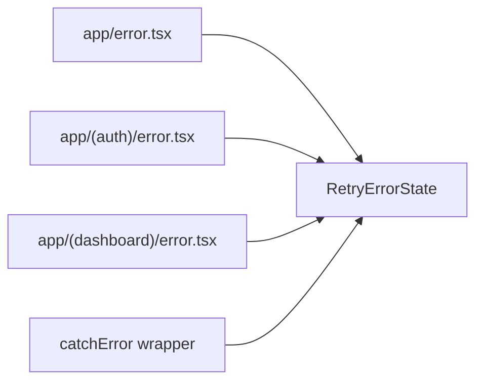

# Task 1 — Shared Retry Error State UI Component

## Reference

- Plan: `docs/plans/plan-24-error-boundaries.md` sections **R — Requirements**, **E — Retry Error UI**, **N — Norms**
- Phase: Section 2 (Implement shared retry UI)

## Description

Create a single reusable client component that renders a styled error recovery state with a retry button. This component is the shared presentation layer for all route-segment error boundaries and the `catchError` wrapper fallback.

### Acceptance Criteria

- [ ] File exists at `components/errors/retry-error-state.tsx`
- [ ] Component is a Client Component (`"use client"`)
- [ ] Accepts `error` (Error | unknown) and `onRetry` (() => void) props
- [ ] Accepts optional `title` string prop for route-specific headings
- [ ] Normalizes unknown errors to a safe user-facing message (never renders raw error.message in production)
- [ ] Renders semantic `<h2>` heading ("Something went wrong") and an explanatory message ("Try again")
- [ ] Renders a `<Button>` from `@/components/ui/button.tsx` wired to `onRetry`
- [ ] Uses shadcn `Card` component with `data-slot` attributes for layout
- [ ] Uses `gap-*` utilities (not `space-*`)
- [ ] Uses `data-icon` on the retry button icon per project convention
- [ ] Keyboard accessible with focus styles matching the project's focus-ring tokens
- [ ] Dev-only `console.error` effect in development mode (guarded by `typeof window !== "undefined"` and process check)
- [ ] Does not display secrets, stack traces, digests, or server internals
- [ ] `npm run lint` passes after adding this file

### Out of Scope

- Route-segment `error.tsx` files (Task 2)
- `catchError` wrapper (Task 3)
- `dashboard`/`auth` specific copy (Tasks 4 and 5)
- Integration tests (Task 6)
- Logging infrastructure or vendor integration

### Domain

Error presentation and recovery UX. Shared across all error boundary layers.

### Affected Files

- **Create:** `components/errors/retry-error-state.tsx`
- **Import by:** `app/error.tsx`, `app/(dashboard)/error.tsx`, `app/(auth)/error.tsx`, `components/errors/catch-error-boundary.tsx`

### Mermaid

