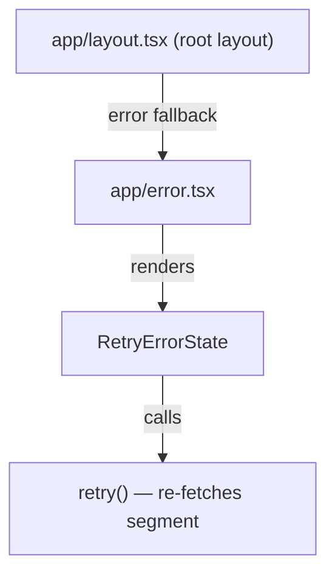

# Task 2 — Root Error Boundary (`app/error.tsx`)

## Reference

- Plan: `docs/plans/plan-24-error-boundaries.md` section **E — Route Error Fallback**, **S — Structure**
- Phase: Section 3 (Add route-segment fallbacks)

## Description

Create the root route-segment error fallback at `app/error.tsx`. This is Next.js's `error.tsx` convention — a Client Component that catches all uncaught errors below the root layout. It receives Next-managed `{ error, retry }` props and delegates presentation to the shared `RetryErrorState` component.

### Acceptance Criteria

- [ ] File exists at `app/error.tsx`
- [ ] Module declares `"use client"` at the top
- [ ] Accepts props `{ error: Error & { digest?: string }; retry: () => void }` with TypeScript types matching the Next.js App Router contract
- [ ] Delegates rendering to `<RetryErrorState error={error} onRetry={retry} title="Application Error" />`
- [ ] Uses `retry()` as the callback (not `window.location.reload()` or router navigation)
- [ ] Does not expose raw error details or digest in production UI
- [ ] Is a minimal shell so the root layout (`app/layout.tsx`) still renders around it
- [ ] Does not interfere with `notFound()` control flow or `redirect()` calls in descendant routes
- [ ] `npm run lint` passes
- [ ] `npm run build` passes (no type errors)

### Out of Scope

- Dashboard-specific error copy (covered in Task 4)
- Auth-specific error copy (covered in Task 5)
- Component-level wrapper `catchError` (covered in Task 3 for reusable use)
- Integration verification (Task 6)

### Domain

Route-segment error handling at the root level. Catches failures in all layout, page, and component subtrees below the root layout.

### Affected Files

- **Create:** `app/error.tsx`

### Mermaid

