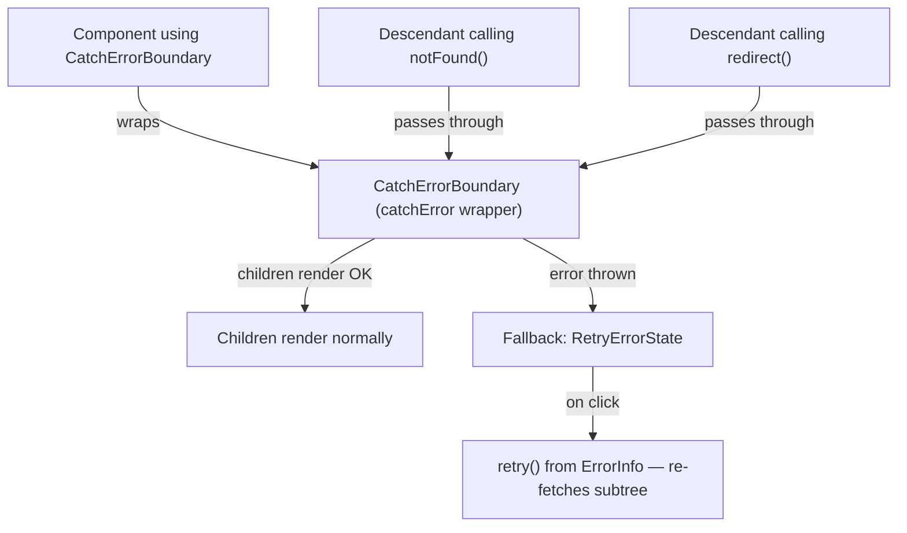

# Task 3 — Component-Level `catchError` Wrapper

## Reference

- Plan: `docs/plans/plan-24-error-boundaries.md` section **E — catchError Boundary**, **A — Approach (catchError API Pattern)**
- Phase: Section 4 (Add a component-level catchError wrapper)

## Description

Create a reusable `catchError`-based wrapper component at `components/errors/catch-error-boundary.tsx` that provides a narrower blast radius than a route-segment error boundary. This uses Next.js 16.3 `catchError` from `next/error` and wraps an explicitly selected subtree where smaller error isolation is useful.

### Acceptance Criteria

- [ ] File exists at `components/errors/catch-error-boundary.tsx`
- [ ] Module declares `"use client"` at the top
- [ ] Imports `catchError` and `type ErrorInfo` from `"next/error"`
- [ ] Defines a fallback component compatible with the `catchError` callback signature: `(props, { error, retry }: ErrorInfo) => ReactNode`
- [ ] Passes `errorInfo.retry` directly to the shared `<RetryErrorState onRetry={retry} />` component
- [ ] Exports the `catchError`-wrapped component as a default React component
- [ ] Component accepts `children` as a prop (consumers place it around the subtree to protect)
- [ ] Accepts optional `fallbackProps` (e.g. title) forwarded to the fallback
- [ ] Descendants calling `notFound()` or `redirect()` retain normal Next.js control-flow behavior (boundary must not catch these)
- [ ] A persistent failure keeps the fallback stable (no infinite automatic retry loop)
- [ ] `npm run lint` passes
- [ ] `npm run build` passes (type-check `catchError` and `ErrorInfo` with the exact installed Next.js 16.3 types)

### Out of Scope

- Wrapping specific subtrees in existing layouts/pages (discovered during audit in Task 6)
- Adding new layout wrappers to `app/(dashboard)/layout.tsx` or `app/(auth)/layout.tsx` (mentioned as future work; not required here)
- Integration verification (Task 6)

### Domain

Component-level error handling with re-fetch capability. Complements route-segment boundaries by isolating failures to a specific subtree.

### Affected Files

- **Create:** `components/errors/catch-error-boundary.tsx`
- **Import by:** Any component needing a narrower error boundary (audit-driven, may be done in Task 6)

### Mermaid

