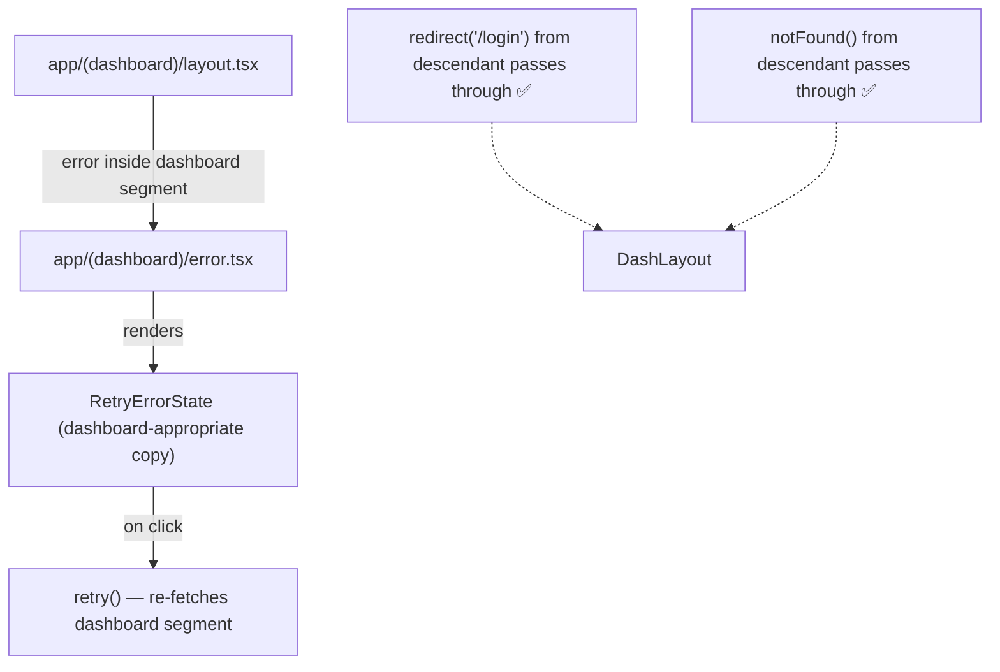

# Task 4 — Dashboard Error Boundary

## Reference

- Plan: `docs/plans/plan-24-error-boundaries.md` section **E — Route Error Fallback (scoped by route segment)**, **S — Structure (app/(dashboard)/error.tsx)**
- Phase: Section 3 (Add route-segment fallbacks)

## Description

Create a dashboard-scoped error fallback at `app/(dashboard)/error.tsx`. This is a Next.js route-segment `error.tsx` that catches errors originating from within the dashboard route group (`(dashboard)/`) while leaving parent layouts available. It uses dashboard-appropriate copy and calls `retry()` for recovery.

### Acceptance Criteria

- [ ] File exists at `app/(dashboard)/error.tsx`
- [ ] Module declares `"use client"` at the top
- [ ] Accepts props `{ error: Error & { digest?: string }; retry: () => void }` matching the Next.js App Router contract
- [ ] Delegates to `<RetryErrorState>` with dashboard-appropriate title and message (e.g. "Dashboard Error", "There was a problem loading the dashboard. Try again.")
- [ ] Uses `retry()` as the recovery callback (not full page reload)
- [ ] Does not make assumptions about authenticated session state (dashboard layout may redirect to login)
- [ ] Does not interfere with `notFound()` or `redirect()` control flow from descendant routes/pages (e.g. `redirect("/login")` should still navigate normally)
- [ ] Does not alter the existing dashboard auth redirect behavior in `app/(dashboard)/layout.tsx`
- [ ] Renders correctly in both light and dark mode (uses semantic token colors)
- [ ] `npm run lint` passes
- [ ] `npm run build` passes (no type errors)

### Out of Scope

- Modifying `app/(dashboard)/layout.tsx` auth guard (the layout's existing redirect must continue working as-is)
- Component-level wrapping in dashboard pages (covered by Task 3's `catchError`)
- Integration verification (Task 6)

### Domain

Route-segment error handling scoped to the dashboard group. Catches failures specific to dashboard content, pages, and component subtrees while preserving the dashboard layout shell.

### Affected Files

- **Create:** `app/(dashboard)/error.tsx`
- **Read:** `app/(dashboard)/layout.tsx` (to confirm no regression in existing auth redirect behavior)

### Mermaid

