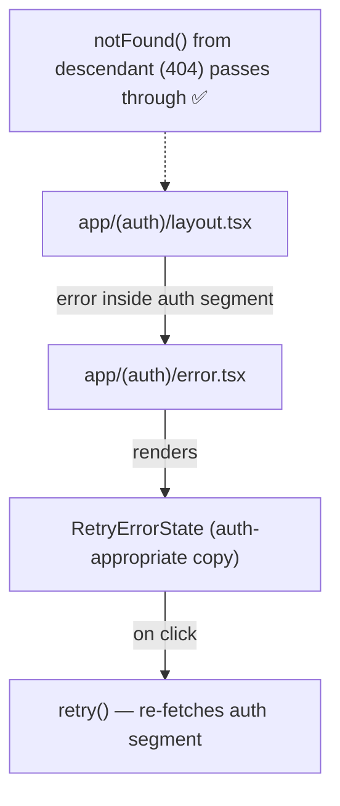

# Task 5 — Auth Error Boundary

## Reference

- Plan: `docs/plans/plan-24-error-boundaries.md` section **E — Route Error Fallback (scoped by route segment)**, **S — Structure (app/(auth)/error.tsx)**
- Phase: Section 3 (Add route-segment fallbacks)

## Description

Create an auth-scoped error fallback at `app/(auth)/error.tsx`. This is a Next.js route-segment `error.tsx` that catches errors originating from within the auth route group (`(auth)/`). The error message must not assume an authenticated session since the user may be on login/signup pages where authentication may not yet exist.

### Acceptance Criteria

- [ ] File exists at `app/(auth)/error.tsx`
- [ ] Module declares `"use client"` at the top
- [ ] Accepts props `{ error: Error & { digest?: string }; retry: () => void }` matching the Next.js App Router contract
- [ ] Delegates to `<RetryErrorState>` with auth-appropriate title and message
- [ ] Does not assume the user is authenticated (auth layout may redirect to login; the error UI must handle both cases)
- [ ] Uses `retry()` as the recovery callback (not full page reload)
- [ ] Does not interfere with `notFound()` control flow (missing auth pages should still show 404 behavior)
- [ ] Does not alter the existing auth layout behavior in `app/(auth)/layout.tsx` (which is a simple centered container)
- [ ] Renders correctly in both light and dark mode using semantic token colors
- [ ] `npm run lint` passes
- [ ] `npm run build` passes (no type errors)

### Out of Scope

- Modifying `app/(auth)/layout.tsx` (auth-specific boundary wrapping — the plan says leave unchanged unless audit finds component-level isolation needed)
- Component-level wrapping in auth pages (covered by Task 3's `catchError`)
- Integration verification (Task 6)

### Domain

Route-segment error handling scoped to the auth group. Catches failures specific to login, signup, and onboarding pages with copy appropriate for unauthenticated context.

### Affected Files

- **Create:** `app/(auth)/error.tsx`
- **Read:** `app/(auth)/layout.tsx` (to confirm no regression in existing layout behavior)

### Mermaid

