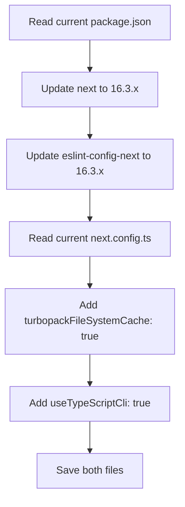

# Task 011 — Upgrade Next.js to 16.3 and enable new config features

## Reference

Plan: [plan-022-migrate-nextjs-163-typescript-7.md](../../plans/plan-022-migrate-nextjs-163-typescript-7.md)

Relevant section: Phase 3 — Next.js 16.3 Upgrade

---

## Description

Upgrade Next.js from `16.2.12` to `16.3.x` in both `dependencies` and `devDependencies` (the `eslint-config-next` peer dependency must match), and add Next.js 16.3-specific config features to `next.config.ts`.

Next.js 16.3 introduces two new opt-in configuration options:
1. **`turbopackFileSystemCache`** — Enables Turbopack file system caching for faster dev server rebuilds (part of the 90% memory reduction in dev).
2. **`useTypeScriptCli`** — Routes build-time type checking through the TypeScript 7 Go compiler for 10x faster checks.

The `next.config.ts` file is currently empty (just a placeholder comment). Replace the placeholder with explicit config enabling these features.

---

## Acceptance Criteria

- [ ] `package.json` has `"next": "16.3.x"` in dependencies (latest 16.3 patch, e.g. `16.3.x`)
- [ ] `package.json` has `"eslint-config-next": "16.3.x"` in devDependencies (matches Next.js version)
- [ ] `next.config.ts` sets `turbopackFileSystemCache: true`
- [ ] `next.config.ts` sets `useTypeScriptCli: true`
- [ ] `next.config.ts` imports `NextConfig` type from `next`
- [ ] `next.config.ts` type-checks correctly with the upgraded Next.js types

---

## Out Of Scope

- TypeScript version upgrade (handled in task-001)
- Lockfile update (handled in task-003)
- Any component or application code changes

---

## Domain

### Next.js 16.3

Next.js 16.3 brings major performance improvements over 16.2:
- 90% less memory usage in dev mode
- 5.5x faster builds
- 22% more SSR throughput
- Instant Navigations

Two new config options are available but opt-in:
- `turbopackFileSystemCache` leverages the Turbopack caching layer to reduce rebuild times
- `useTypeScriptCli` routes through the TypeScript 7 Go compiler

These options have zero configuration overhead — just set `true`. Since the config file is currently empty, there's no risk of conflicting options.

Importance:

The config must match the upgraded Next.js version; leaving it empty means missing out on the performance gains the migration is meant to achieve.

Implementation scope:

Update both `next` and `eslint-config-next` versions in package.json, then populate `next.config.ts` with the two new config flags.

---

## Graph

