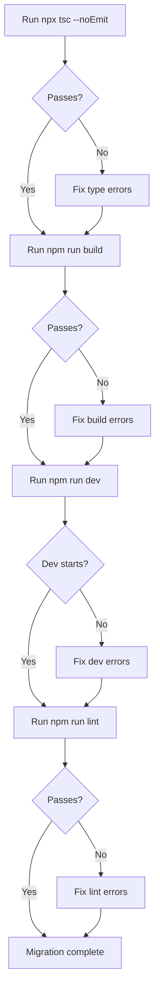

# Task 013 — Build, type-check, lint, and dev server verification

## Reference

Plan: [plan-022-migrate-nextjs-163-typescript-7.md](../../plans/plan-022-migrate-nextjs-163-typescript-7.md)

Relevant section: Phase 4 — Installation and Validation (step 2–4)

---

## Description

Run the full verification suite against the upgraded stack. This is the final gate that confirms the migration is complete and the app remains functional.

Execute in order:

1. `npx tsc --noEmit` — Verify TypeScript 7 type-checking passes with zero errors
2. `npm run build` — Build the app with Next.js 16.3 (Turbopack + TS7 Go compiler)
3. `npm run dev` — Start development server and confirm it binds to port 3000 without errors
4. `npm run lint` — Run ESLint with the matching `eslint-config-next` 16.3

Fix any errors that appear. There should be no code changes—only configuration issues, if any.

---

## Acceptance Criteria

- [ ] `npx tsc --noEmit` exits with code 0 (zero type errors)
- [ ] `npm run build` completes without errors
- [ ] `npm run dev` starts and reports server listening on port 3000
- [ ] `npm run lint` exits with code 0 (no lint errors)
- [ ] No deprecation warnings appear in build/dev output
- [ ] If any error or warning appeared: it was fixed or documented with justification

---

## Out Of Scope

- Performance benchmarking (out of scope for this migration pass)
- Browser-level page rendering tests (manual verification only)
- CI/CD pipeline update (handled separately)

---

## Domain

### Build Verification

Next.js 16.3 uses Turbopack for both dev and build phases. The `turbopackFileSystemCache` and `useTypeScriptCli` flags in `next.config.ts` must interact correctly with the build pipeline. Any TS7 breaking changes in the type system would surface here, as would Next.js 16.3 API changes.

Importance:

This is the acceptance gate. If the build, type-check, lint, and dev server all pass, the migration is production-ready.

Implementation scope:

Run each verification command in sequence. If any fails, diagnose and fix the root cause (typically a deprecated option, incompatible type, or API deprecation). If everything passes, confirm and stop.

---

## Graph

