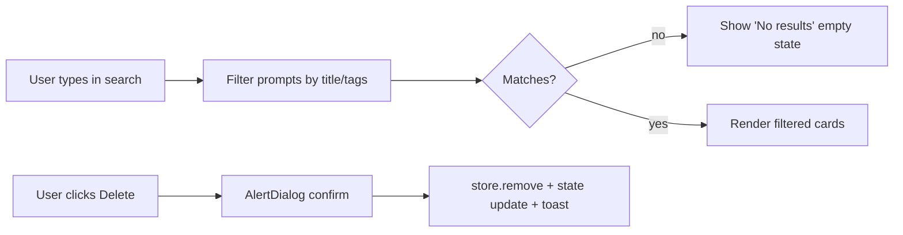

# Task AGE-14-2: Prompts List — Add Search, Wire Delete, Show Tags

## Reference

Plan: `docs/plans/plan-AGE-14-prompt-storage-missing.md`, Sections S (Structure), O (Operation §2), N (Navigability)

## Description

Upgrade the `/prompts` list page with a search input that filters prompts by title or tags (case-insensitive), wire the existing `onDelete` callback on `PromptCard` with confirmation via AlertDialog and toast feedback, and render stored tags as `<Badge>` elements on each card. Mirrors the pattern already implemented in `app/(dashboard)/skills/page.tsx` (search + delete + toast).

The page distinguishes three states: **no prompts at all** (full empty state), **no matches** (empty state with "no results" text), and **matches** (filtered grid).

## Acceptance Criteria

- An `<Input>` placeholdered `"Search prompts..."` appears above the prompt grid, max-width `sm` (matching skills page).
- Typing in the search filters the grid to prompts matching the query against `title` or any `tag`, case-insensitive.
- Whitespace-only or empty query shows all prompts (no filtering).
- If all prompts are deleted, the original "No prompts yet" empty state returns.
- If prompts exist but none match the query, render an empty state: "No results found" with "View all prompts" button.
- Clicking Delete on a `PromptCard` opens an `AlertDialog` for confirmation (pattern: `components/ui/alert-dialog.tsx`).
- Confirming Delete calls `store.remove(id)`, updates local state, and shows a `"Prompt deleted"` success toast; failure shows an error toast.
- Tags from `prompt.tags` render as `<Badge>` elements below the title or input snippet within each card.
- `npm run lint` passes.

## Out of Scope

- Editing tags from the list view.
- Pagination or infinite scroll.
- Sort order controls (sorting is handled by store, Task 4).
- Delete of prompts from another tab (handled by `visibilitychange` listener already present).

## Domain

UI — `app/(dashboard)/prompts/page.tsx`, `components/prompt/PromptCard.tsx`

## Mermaid Graph



## Structure

| File | Change |
|---|---|
| `app/(dashboard)/prompts/page.tsx` | Add `query` state `<Input>`, computed `filtered` array, handle `handleDelete` with AlertDialog + toast, two empty states. |
| `components/prompt/PromptCard.tsx` | Render `prompt.tags` as `<Badge>` elements in `CardHeader` or `CardContent`. |

## Operation

### List page (`page.tsx`)

1. Add `const [query, setQuery] = useState("")`.
2. Compute filtered array:
   ```
   filtered = query.trim()
     ? prompts.filter(p => p.title.toLowerCase().includes(q) || p.tags.some(t => t.toLowerCase().includes(q)))
     : prompts
   ```
3. Replace single empty state with conditional rendering:
   - `prompts.length === 0` → "No prompts yet"
   - `filtered.length === 0` → "No results"
   - else → grid of `PromptCard` with `onDelete={handleDelete}`
4. `handleDelete(id)`: open `AlertDialog` → on confirm call `remove(id)`, filter local state, toast success/fail.

### PromptCard (`PromptCard.tsx`)

5. Accept `prompt.tags` from the `Prompt` type (already present after Task 1).
6. Render tags in a `<div className="flex flex-wrap gap-1 mt-2">` with `<Badge variant="outline" key={tag}>` for each.

### AlertDialog pattern

7. Use the existing `components/ui/alert-dialog.tsx` (triggers: `AlertDialog`, `AlertDialogTrigger`, `AlertDialogContent`, `AlertDialogHeader`, `AlertDialogTitle`, `AlertDialogDescription`, `AlertDialogFooter`, `AlertDialogCancel`, `AlertDialogAction`).
8. Trigger button remains the same destructive button; on click open dialog instead of immediately deleting.

### Edge cases handled

- Empty tags array → no badges rendered (no crash).
- Whitespace-only search query → all prompts shown.
- Prompt deleted concurrently (tab close) → `handleDelete` gracefully errors on `remove()` returning `false` (show toast).
- `prompt.tags` is somehow undefined → treated as `[]` by optional chaining in the filter.