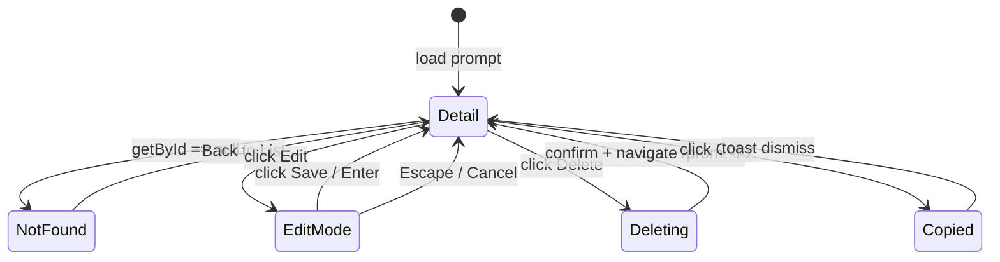

# Task AGE-14-3: Detail Page — Add Copy, Edit, Delete, 404 Handling

## Reference

Plan: `docs/plans/plan-AGE-14-prompt-storage-missing.md`, Sections S (Structure), O (Operation §3)

## Description

Enrich the prompt detail view (`/prompts/[id]`) with Copy-to-clipboard, inline title editing (Edit/Save mode), Delete with AlertDialog confirmation, and a proper 404 state when `getById` returns `null`. The detail page shows all prompt sections via `PromptOutput`, metadata (tags, version, dates), and action buttons. Follows the conventions already established in the generator component for clipboard copy.

The existing `PromptEditor` component serves as the backbone but is enhanced with a non-mutating detail mode that shows the title in a read-only manner until the user clicks "Edit", then switches to editable `<Input>`.

## Acceptance Criteria

- Detail page renders the full prompt content via `<PromptOutput content={prompt.content} />` showing all sections.
- Metadata line below the title shows `tags` (as badges), `version`, and creation/update dates.
- **Copy button**: serializes the prompt sections into the same multi-line format as `PromptGenerator.handleCopy()`, writes to clipboard, and shows a `"Copied to clipboard"` success toast or `"Failed to copy"` error toast.
- **Edit button**: toggles the title into an editable `<Input>`; the user saves by clicking a "Save" button or pressing Enter. On save, `store.update(id, { title })` is called; success updates local state, exits edit mode, shows a `"Prompt saved"` toast. Failure shows `"Failed to save"` toast.
- **Delete button**: opens `AlertDialog`; confirming calls `store.remove(id)`, shows toast feedback, and navigates to `/prompts` on success.
- **Back to List** link remains visible throughout.
- When `getById(id)` returns `null` (prompt not found): render a centered 404-style state with heading "Prompt not found", body text explaining the prompt couldn't be located, and a "Back to List" button linking `/prompts`. No console errors or React crashes.
- `npm run lint` passes.

## Out of Scope

- Editing generated section content (role, tools, workflow, etc.) — plan explicitly keeps editing title-focused.
- Inline tag editing from detail view.
- Version history diff or rollback.
- Duplicate prompt action.

## Domain

UI — `app/(dashboard)/prompts/[id]/page.tsx`, `components/prompt/PromptEditor.tsx`

## Mermaid Graph



## Structure

| File | Change |
|---|---|
| `app/(dashboard)/prompts/[id]/page.tsx` | Add `useState` for `prompt` + `isEditing`; wire `handleCopy`, `handleDelete`, `handleEditToggle`, `handleSaveTitle`; conditional render 404 or `PromptEditor`. |
| `components/prompt/PromptEditor.tsx` | Accept `isEditMode` / `onSaveTitle` props; add metadata row (`tags`, `version`, dates); add Copy/Edit/Delete buttons above `PromptOutput`. |

## Operation

### Detail page (`[id]/page.tsx`)

1. Replace `useState(() => getById(params.id))` with proper state + `useEffect` or `useState` initializer:
   ```
   const [prompt, setPrompt] = useState<Prompt | null>(() => getById(params.id));
   const [isEditing, setIsEditing] = useState(false);
   ```

2. Compute page title: `prompt?.title ?? "Prompt not found"`.

3. `handleCopy()`: same serialization as `PromptGenerator.handleCopy()` (build multi-line string from sections), `await navigator.clipboard.writeText(formatted)`, toast feedback.

4. `handleDelete()`: confirm via `AlertDialog`, call `store.remove(id)`, toast feedback, `router.push("/prompts")` on success.

5. `handleEditToggle()`: toggle `isEditing` between `true`/`false`.

6. `handleSaveTitle()`: when `isEditing`, call `store.update(id, { title })`, set `setPrompt(updated)`, `setIsEditing(false)`, toast feedback.

7. Conditional render: `prompt === null` → 404 state; else → `PromptEditor` with current props.

### PromptEditor (`PromptEditor.tsx`)

8. Add metadata row: render tags (if any), version string, and date range ("Created … · Updated …").

9. Add a toolbar row above `PromptOutput` with: Copy, Edit (toggles edit mode), Delete (opens AlertDialog), and Back.

### 404 state

10. Centered layout with `h6` title "Prompt not found", `p` description "The prompt you're looking for doesn't exist or was deleted.", and a `Button` linking to `/prompts`.

### Edge cases handled

- Clipboard unavailable (private mode, no secure context) → catch block shows `"Failed to copy"` toast.
- Edit submitted empty title → allow save (store `update` writes it); or show a brief "Title is empty" toast.
- Prompt deleted by another tab while viewing detail → `visibilitychange` listener already refreshes from store; if not refreshed, `getById` returns null on re-read → 404 displays on next render.
- `getById(id)` for non-existent UUID → null → 404 state.