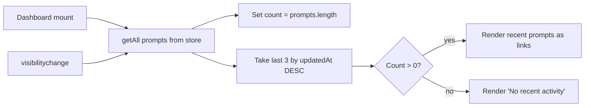

# Task AGE-14-4: Dashboard — Real Prompt Count and Recent Activity

## Reference

Plan: `docs/plans/plan-AGE-14-prompt-storage-missing.md`, Sections S (Structure), O (Operation §4)

## Description

Replace the hardcoded prompt count (`count: 0`) on the dashboard stats cards with a real count derived from `getAll()` in the prompt store. Add a "Recent Activity" section listing up to the three most recently updated prompts, linked to their detail pages. The dashboard refreshes on `visibilitychange` so changes made in the prompts pages (create, delete, edit) are reflected when the user returns.

Mirrors how the dashboard already fetches agent counts from `@/lib/agents/store` with `getAll().length`.

## Acceptance Criteria

- Dashboard imports `getAll` from `@/lib/prompts/store`.
- Prompt count on the stats card shows the actual number of stored prompts (`prompts.length`), not `0`.
- A "Recent Activity" section under the existing "Quick Actions" section displays up to 3 recent prompts.
- Recent prompts are ordered by `updatedAt` descending (newest first).
- Each recent prompt entry links to `/prompts/{id}` and shows the prompt title as a clickable link.
- When no prompts exist, the existing "No recent activity" card remains as the empty state.
- Dashboard values refresh when the browser tab regains visibility (`visibilitychange`).
- `npm run lint` passes.

## Out of Scope

- Activity entries for created/updated/deleted actions (plan only says "show prompts", not full audit log).
- Pagination for recent activity when more than 3 prompts exist.
- Date/time stamps on activity entries.
- Activity tracking for skills or agents.

## Domain

UI — `app/(dashboard)/dashboard/page.tsx`

## Mermaid Graph



## Structure

| File | Change |
|---|---|
| `app/(dashboard)/dashboard/page.tsx` | Import `getAll` from prompt store; add `promptsCount` state; compute recent prompts; render "Recent Activity" section; add `visibilitychange` listener. |

## Operation

### State initialization

1. Import `getAll` from `@/lib/prompts/store`.
2. Add state for prompt count and recent prompts:
   ```
   const [promptsCount, setPromptsCount] = useState(() => getAll().length);
   ```

### Stats card update

3. Replace the hardcoded `count: 0` for the "Prompts" stat card with `count: promptsCount`.

### Recent Activity section

4. Add a new `<div>` section below "Quick Actions" with heading "Recent Activity".
5. When `promptsCount > 0`:
   - Sort the full prompt list by `updatedAt` descending (use `getAll().sort(...)`).
   - Take the first 3 via `.slice(0, 3)`.
   - Render each as a `<Link href={`/prompts/${p.id}`}>` containing the truncated title.
   - Use a simple list or card items — no new components needed (existing `Card` + `CardContent` suffice).
6. When `promptsCount === 0`: render the existing "No recent activity" placeholder card.

### Visibility refresh

7. Add a `useEffect` hook mirroring the pattern in prompts and skills pages:
   ```
   useEffect(() => {
     function handleVisibility() {
       if (document.visibilityState === "visible") {
         setPromptsCount(getAll().length);
       }
     }
     document.addEventListener("visibilitychange", handleVisibility);
     return () => document.removeEventListener("visibilitychange", handleVisibility);
   }, []);
   ```

### Edge cases handled

- No prompts → empty state shown (current behavior preserved).
- Less than 3 prompts → show fewer entries (no empty slots).
- Prompt deleted from another tab → `visibilitychange` refreshes count.
- Malformed dates from legacy data → `getAll()` already sorts with fallback (Task 1 guarantees).
- Storage unavailable during initial render → `getAll()` returns `[]` → `count: 0` → safe.